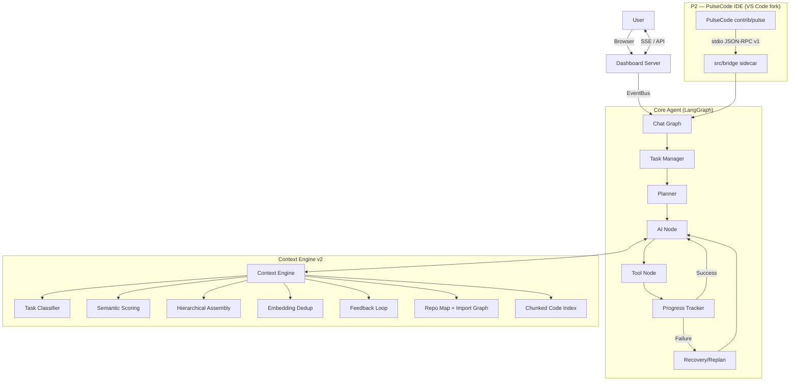

# PulseAI (PulseCodeAI)

PulseAI is an autonomous senior-engineer agent built with LangGraph and LangChain. It features a "Claude-Quality" ecosystem, a real-time Agentic IDE dashboard, and a task-aware context engine designed for high-precision autonomous coding.

> **Two eras, one repo.** The **engine** (`src/`) is a complete, test-pinned autonomous coding agent (~25K LOC). The **IDE** (`desktop/` + `docs/P2-roadmap.md`) is the current phase: a VS Code fork — **PulseCode** — where the frozen engine becomes a native AI IDE through a stdio bridge (`src/bridge/`). See [Current Status](#-current-status-2026-08-08) below.

---

## 📊 Current Status (2026-08-08)

**Engine: complete and frozen.** The agent loop, context engine, memory, and tooling have shipped through 35 debt items (D1–D35) plus 10 hermes-pattern steals — all closed, each one verified empirically before merge and pinned by the regression suite (**437 → 445 green**). The engine is now treated as *completed work*: new engine ideas go through the old board as separate D-items, never into the fork's milestones.

**IDE: P2 Phase 0 in progress.** The roadmap (`docs/P2-roadmap.md`) is scope-frozen and follows a strict **2-line rule**: upstream VS Code is touched in exactly two places (`product.json` branding + one import line); everything else lives in a new `contrib/pulse/` directory.

- ✅ 0.1–0.3 — fork plan, rebrand ("PulseCode"), skeleton patch (`patches/pulscode-m1-skeleton.patch`)
- ✅ 0.4 — engine-side bridge: `src/bridge/` stdio JSON-RPC v1 sidecar (stdlib-only codec, 1 MiB line guard, handshake + version check, never-dies-on-garbage) — **the only door** between the fork and the engine
- ⏳ 0.5 / M1 — sidebar "Pulse" view + chat round-trip through the real engine (tool calls as cards)
- M2–M5 — native diff-approval UX, live telemetry, checkpoint time-machine, installers

Every design decision, review round, and measurement lives in **[ARCHITECTURE_REVIEW.md](ARCHITECTURE_REVIEW.md)** — a 48-round development journal. It is the honest history of the project, including the claims that were rejected.

---

## 🧠 The Claude-Quality Transformation

PulseAI follows a 6-step transformation to ensure professional, safe, and high-quality outputs:

1. **Persona Injection:** Warm, professional, and thoughtful senior engineer tone.
2. **Thinking & Polish:** Explicit `think()` reasoning steps before actions.
3. **Tone & Persistence:** Adapts tone to task complexity; memories persist in `~/.pulseai/`.
4. **Conventions & Safety:** `ConventionLearner` auto-detects your project DNA; `SafetyGuard` protects against risky actions.
5. **Reflection & Compression:** `ReflectionEngine` harvests permanent lessons; `SmartCompressor` manages long-term semantic memory.
6. **Ecosystem Layer:** `CostRouter` for multi-tier model selection and `SubAgentCoordinator` for specialized tasks.

---

## 🖥️ Agentic IDE Dashboard

PulseAI includes a real-time web interface (**Agentic IDE**) with a red-neon EKG branding.

- **Live Streaming:** Watch the agent's thought process and tool calls via SSE.
- **Interactive Chat:** Communicate with the agent directly from the browser.
- **Tool Approval:** Manually approve or deny sensitive tool calls (file writes, terminal commands).
- **Real-time Analytics:** Track tokens, cost, and agent status live.

**To run the dashboard:**
```bash
python src/dashboard_server.py
```
Then open `http://localhost:8080`.

---

## ✨ Features

### Autonomous Coding Workflow
- **Planning:** Generates multi-step execution plans before acting.
- **Execution:** Modifies files, runs terminal commands, and performs web searches.
- **Recovery:** Automatically detects and recovers from tool or terminal failures.
- **Replanning:** Pivot strategy mid-task if the current plan becomes unviable.

### Task-Aware Context Engine (v2)
PulseAI builds a 16-layer context for every LLM call. Unlike v1 (static order, fixed budget), v2 is task-aware:

- **Task Classification:** Regex heuristics + embedding similarity classify each task into 9 types (debug, create, refactor, test, explore, explain, plan, recovery, chat).
- **Relevance Scoring:** Every layer is scored `60% task-type prior + 30% semantic similarity + 10% recency`; low-value layers are skipped entirely.
- **Hierarchical Assembly:** Layers are packed into a token budget highest-relevance-first; oversized layers are compressed rather than dropped.
- **Semantic Dedup:** Embedding near-duplicate detection (cosine > 0.88) removes redundant layers.
- **Differential Caching:** Layers are only rebuilt when non-message state changes.
- **Semantic History Compression:** `SmartCompressor` scores each past message by similarity to the current task (plus type/recency heuristics), not just age.
- **Feedback Loop:** Completed tasks record which layers were used; layer weights drift ±3% toward successful compositions.
- **Chunked Code Index:** `chunk_index.py` — tree-sitter/AST chunks → sqlite-vec KNN + FTS5 BM25 → RRF fusion, with a vec0 KNN pushdown (12–14×) and feature re-ranking (D13/D14). Wired into DEBUG/CREATE/REFACTOR tasks as `relevant_chunks`.
- **Dynamic Context-Window Discovery:** env override → on-disk cache → static table → live provider probe, so unknown models budget correctly instead of guessing.
- **Session-Scoped Engines:** one ContextEngine per thread (`thread_id`), so no session's cache or learned weights leak into another's.

### Long-Term Memory
- **Persistent Memories:** Past task results and lessons are stored in `~/.pulseai/memories.json`.
- **Vector Memory:** Semantic store (sentence-transformers embeddings) for preferences, reflections, and tool outputs — **SQLite-backed at `~/.pulseai/vector_memory.db`, survives restarts**.
- **Reflections:** Learned behaviors and "don't-do-this" lessons are indexed via `ReflectionEngine`.
- **Skills:** Frequently used command patterns or workflows are saved to `skills.json`.

### Agent Tools (29 total)
File tools (`read_file`, `list_files`, `search_code`, `write_file`, `edit_file` — atomic + fuzzy block-span), terminal tools (`run_terminal` + background process lifecycle), web tools (`web_search`, `web_fetch` — stdlib readable-text extraction), `execute_code` (one scripted call chains tools in-process), `session_search` (zero-LLM recall of past sessions via FTS5), `think`/`verify`/`ask_user`, sub-agent delegation (`delegate_to_subagent` + parallel `delegate_to_subagent_batch`), and **browser tools** (`browser_navigate` / `browser_snapshot` / `browser_screenshot` / `browser_click` / `browser_type` / `browser_select_option` / `browser_hover` / `browser_evaluate` — a lazy puppeteer-MCP client in `src/tools/browser_mcp.py` that lets the agent open a page, read it back as an accessibility summary, screenshot it, and interact with it, so it can **see and verify its own UI output**).

---

## 🔬 Lab-Verified: Durability, Efficiency & Eyes (2026-08-09)

The engine was driven end-to-end on a real integration task (shadcn/Spline React components into `/components/ui`) from an **empty sandbox** — and survived the gauntlet:

- **Durability:** completed the task (plan 8/8, EXIT 0) across a broken `npx` environment, a **disk-full crash mid-`npm install`**, a process kill, and a **checkpoint resume in a new process** — 26 API calls, 413k tokens, **$0.041**. The F2 None-planner guard, provider failover (F3), and recovery-pivot fixes that made this possible are in this tree.
- **Efficiency (measured):** per-call prompt was 15.2k tokens, 73% static re-sends. Tool definitions trimmed 5,686 → 4,232 tokens/call (-26%) and context layers capped → **static per-call cost down ~31%**.
- **Eyes:** the puppeteer-MCP browser tools above verified the built frontend live — navigated to the dev server, read the page, and screenshotted it.

The frontend the agent built, rendered (Next.js + Tailwind + Spline 3D):


The eval harness lives in `lab/` (`run_eval_shadcn.py`, `resume_eval_shadcn.py`); full findings are in `lab/LAB_REPORT.md`. On Windows boxes whose npm is configured with `bin-links=false` (which breaks `npx`), `src/tools/terminal_tools.py` injects `NPM_CONFIG_BIN_LINKS=true` into every spawned shell.

---

## ⚖️ v2 vs v1: The Honest Diff

Everything below was verified by running both versions — v2 (`ae04d77`) is the better engine. Not because it's newer, but because it fixes concrete v1 weaknesses:

| Area | v1 (previous commit) | v2 (current) | Verdict |
|---|---|---|---|
| Task awareness | Same 15 layers, same order, every call | Task classified into 9 types; per-type relevance & budgets | **v2** — v1 wasted tokens on irrelevant layers |
| Context budgeting | Static split; steal from history when over | Type-specific ratios + hierarchical fit + per-layer compression | **v2** |
| History trimming | Heuristic scoring (type + recency) | Semantic similarity to current task + heuristics | **v2** |
| Embeddings | `SimpleEmbedding` — hash bag-of-words, no meaning | `all-MiniLM-L6-v2` — real semantics, shared singleton | **v2** |
| Repo map symbols | Regex (`^def`/`^class`), missed async/decorators | AST-based, handles async + decorators, lists imports | **v2** |
| Import graph | None | AST import graph (top 20 files × 5 imports) | **v2** |
| Repo map compression | Stripped every ` -> ` line — silently killed symbols *and* the import graph | Preserves the import graph through compression | **v2** (bug fixed) |
| Dedup | None | Embedding near-duplicate removal (0.88 threshold) | **v2** |
| Feedback | None | Records completions, adjusts layer weights | v2 (partial — see caveats) |

### Verified caveats (read before believing the hype)

1. **Feedback is coarse, not attributed.** Success/failure is recorded from `finalize_node`, `recovery_limit_node`, and `replan_node`. The loop shifts layer weights ±3%, but `record_feedback` snapshots the live layer cache, which is empty outside `build_ai_messages` — so it can't yet attribute an outcome to *which* layers matter. It learns that failure happened, not why. (Verified working; the attribution gap is next.)
2. **Embedder cold-start is heavy.** First load takes ~30s and downloads ~100MB (`all-MiniLM-L6-v2`, CPU). If it fails, classifier, compressor, and dedup all fall back to heuristics — which is by design, but the semantic features silently downgrade.
3. **Import graph is a hint, not a graph.** 20 files × 5 imports, top-level modules only — no transitive deps, no call sites.
4. **Chunk retrieval exists but is narrow.** `chunk_index.py` (sqlite-vec KNN + FTS5 BM25 → RRF) is wired into ContextEngine as `relevant_chunks` for DEBUG/CREATE/REFACTOR tasks; other task types still assemble at layer granularity.
5. **SQLite search is a LINEAR scan.** `search()` scores the most recent 500 rows in Python — correct and persistent, but not a real vector index. Time to scale past ~10K memories.
6. **The pre-send guard covers messages, not tool defs.** `RetryLLMProxy` trims the message list to `PROVIDER_SAFE_LIMIT` (default 6000), but `bind_tools` payloads ride along untouched — a 50-tool definition list can still push a request over a tight provider limit.

> **Note:** caveats #1 (layer attribution), #4 (chunk retrieval wiring), and the memory-index part of #5 were addressed after the v2 comparison was written — see the D-series in [ARCHITECTURE_REVIEW.md](ARCHITECTURE_REVIEW.md) (§1, §15–16, §6, §20, §37) for the follow-up work. The table above is preserved as the honest v2-vs-v1 record.

---

## 🆚 Can It Compete With Cursor? (The Straight Answer)

**What's genuinely strong:**
- Task-aware, budget-bounded context assembly with semantic scoring beats the naive "stuff everything in" approach most OSS agents use. Tokens go to relevant layers.
- AST-accurate repo map with import graph + semantic dedup gives solid structural grounding per call.
- Zero-cost local embeddings — no API spend for context features.
- Differential caching means the heavy work happens once, not every turn.
- A real chunked code index: tree-sitter/AST chunks → sqlite-vec KNN + FTS5 BM25 → RRF, incrementally synced via a file watcher — the gap this README previously flagged as "the next milestone" is now shipped (`src/context/chunk_index.py`, C1/KNN pushdown, D13/D14 re-rank).

**What Cursor has that this does not (yet):**
- LSP/editor integration, `@`-references, git-aware context (partially covered by `git_context.py`).
- A 200K-token model window with automatic file inclusion. PulseAI budgets a fixed `max_tokens` with heuristic ratios (dynamic per-model window discovery shipped — see Features).
- A polished native IDE surface. This is exactly what the **P2 PulseCode fork** is building: native diff-approval, checkpoint timeline, telemetry panel, inline completions — with the frozen engine behind a stdio bridge.

**Bottom line:** the engine's context layer, chunked code index, and persistent memory are a credible foundation — above typical OSS agent scaffolding. The remaining moat work is now on the product side: turning the fork into the native IDE that surfaces this engine (P2, in progress).

---

## 🏗️ Architecture



---

## 📁 Project Structure

```text
PulseAIRepo/
├── src/
│   ├── main.py                     # CLI Entrypoint
│   ├── dashboard_server.py         # Web IDE Backend
│   ├── bridge/                     # P2: stdio JSON-RPC v1 sidecar — the ONLY door
│   │   │                           #     between the PulseCode fork and the engine
│   │   ├── protocol.py             #     stdlib-only codec (frozen protocol v1)
│   │   └── __main__.py             #     sidecar entrypoint
│   ├── agents/                     # Specialist agents (Planner, SubAgent, CostRouter)
│   ├── context/                    # Context, Memory, Safety, and Tone layers
│   │   ├── context_engine.py       # Task-aware, budgeted context assembly
│   │   ├── chunk_index.py          # Chunked code index (sqlite-vec KNN + FTS5 BM25 → RRF)
│   │   ├── repo_map.py             # AST repo map + import graph
│   │   ├── smart_compressor.py     # Semantic history compression
│   │   ├── vector_memory.py        # SQLite-backed semantic store
│   │   ├── safety_guard.py         # Human-in-the-loop approval logic
│   │   ├── reflection_engine.py    # Learning from past mistakes
│   │   ├── convention_learner.py   # Style matching logic
│   │   ├── session_index.py        # FTS5 session recall (session_search tool)
│   │   ├── embedding_cache.py      # Process-wide content-addressed embed cache
│   │   ├── model_budgets.py        # Dynamic context-window discovery
│   │   └── ... (git_context, compaction, token_budget, etc.)
│   ├── graphs/                     # LangGraph workflow definitions (chat_graph, parallel_tools)
│   ├── llm/factory.py              # LLM + shared embedder factory (main + auxiliary clients)
│   ├── providers/                  # Multi-LLM provider support (Groq, OpenAI, Gemini, NVIDIA, custom)
│   ├── tests/                      # pytest regression suite — 445 green
│   └── tools/                      # File, Terminal, Web, Code-Exec, Session-Search tools
├── desktop/                        # VS Code fork (code-oss 1.130.0) — PulseCode desktop app
├── docs/                           # P2 analyses (roadmap, Kilo Code UX, VS Code fork) + hermes report
├── patches/                        # Engine + fork patch archive (D-series, P2 skeleton)
├── scripts/                        # Measurement/benchmark scripts (each D-item's receipts)
├── ARCHITECTURE_REVIEW.md          # 48-round development journal — the honest history
├── dashboard.html                  # Agentic IDE Frontend
├── pyproject.toml                  # Dependencies & Project Meta (uv-managed)
└── uv.lock
```

---

## ⚙️ Configuration

Copy the example environment file and set your keys:
```bash
cp .env.example .env
```

**Custom Provider Example:**
```env
LLM_PROVIDER=custom
CUSTOM_BASE_URL=https://your-api-url/v1
CUSTOM_API_KEY=sk-your-key
```

**Embeddings (optional, defaults are local + free):**
```env
EMBEDDING_PROVIDER=local          # local (sentence-transformers) | openai (not implemented yet)
EMBEDDING_MODEL=all-MiniLM-L6-v2
EMBEDDING_DEVICE=cpu              # cpu | cuda
```

**Context window (optional):**
```env
PROVIDER_SAFE_LIMIT=0             # 0 = auto: engine budget + pre-send guard resolve the
                                  #     model's discovered window − 4,096 (paid tiers)
                                  # default 6000 = conservative out of the box
```

---

## 🧪 Testing

PulseAI keeps a pytest regression suite — currently **~475 green** across graph, context, dashboard, tools, and the bridge. Every shipped change is pinned by tests, and each D-item's measurement script lives in `scripts/` as its receipt.

**Run the suite:**
```bash
uv sync                       # or: uv pip install -e . --group dev
uv run pytest                 # from the repo root (pythonpath = . is configured)
```

**Key Test Modules:**
- `test_planner_manual` / `test_replan_graph`: Plan generation and mid-task strategy shifts.
- `test_event_bus` / `test_dashboard_server`: Dashboard streaming reliability and input validation.
- `test_plan_approval` / `test_plan_cancel` / `test_plan_revision`: Human-in-the-loop approval flows.
- `test_parallel_tools` / `test_file_state`: D34 batch gate + D32 stale-write guard.
- `test_lab_fixes`: recovery-pivot classification, provider failover, planner degradation, repo-map bound — the lab-driven engine fixes.
- `test_bridge`: P2 stdio protocol pins (handshake, version mismatch, garbage tolerance, shutdown).
- `test_prompt_guard`: Persona anti-drift pins (D35).

---

## 🛡️ Safety Guard

PulseAI classifies every tool call. If a tool is marked as **destructive** (e.g., `write_file`, `run_terminal`), the agent pauses and waits for user approval via the Dashboard or CLI. This prevents the agent from making unwanted changes without oversight.

- Interactive threads: unsafe calls return an approval question and nothing executes.
- Sub-agent threads (no human reading): unsafe calls **auto-deny** (D20) and become denial messages the model can adapt to — opt-in escape hatch `PULSEAI_SUBAGENT_AUTO_APPROVE=1`.
- The guard is a **checkpoint, not a sandbox**: command substitution (`$()` / backticks) always escalates to approval; `run_terminal` remains `shell=True` by design so pipes, redirects, and `&&` keep working.

---

## 📚 Development Journal

**[ARCHITECTURE_REVIEW.md](ARCHITECTURE_REVIEW.md)** is the project's live history — 48 rounds of "verify, then merge." Every pasted review, external-pattern steal, and internal audit is adjudicated empirically: claims are checked against the actual tree, false claims are rejected with evidence, and real bugs get shipped with tests + measurement receipts. Debt items D1–D35 are all closed; the remaining board is P2 (the fork) plus candidate D37 (skills registry, parked until a measured gap exists).

---

## 🗺️ Roadmap

**Engine era (complete):**
- [x] 6-Step Claude-Quality Transformation
- [x] Agentic IDE Dashboard (Red Neon)
- [x] Multi-agent Collaboration Layer (sub-agents + parallel batches)
- [x] Task-aware Context Engine v2 (classification, scoring, budgets, dedup)
- [x] AST repo map + import graph
- [x] Tool-memory writer (semantic store of past tool outputs)
- [x] Persistent vector memory (SQLite, `~/.pulseai/vector_memory.db`)
- [x] Failure feedback wired (recovery-limit, replan give-up, finalize)
- [x] Pre-send token guard (`PROVIDER_SAFE_LIMIT`, 503 mitigation — verified live)
- [x] Chunk-level code retrieval (sqlite-vec KNN + FTS5 BM25, RRF fusion — `src/context/chunk_index.py`)
- [x] Layer attribution of feedback (session-scoped engines, per-engine attribution snapshots — D1)
- [x] D1–D35: session scoping, embed cache, multi-language chunk index, KNN pushdown, re-ranking, compaction, classifier quick path, batch gate, file-state guard, shadow checkpoints, prompt-cache audit, and the hermes pattern steals
- [ ] Per-session cost reports in PDF format

**IDE era — P2 PulseCode (active, scope-frozen in `docs/P2-roadmap.md`):**
- [x] Phase 0: fork plan + rebrand + bridge v1 (`src/bridge/`) + skeleton patch
- [ ] M1 — Brain inside the body: sidebar chat round-trip through the real engine, tool cards
- [ ] M2 — Safety UX: native diff-approval for every guarded edit, question dock
- [ ] M3 — Telemetry: live budget bar + usage card (cache on its own line)
- [ ] M4 — Time machine: checkpoint timeline with one-click restore + undo-the-undo
- [ ] M5 — Shipping: installers (Windows first), engine bundled, upstream-sync ritual
