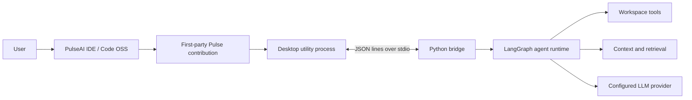

# PulseAI IDE

PulseAI IDE is a Code OSS fork with a first-party autonomous coding agent named **Pulse**. The repository contains the desktop IDE, the Python agent runtime, the versioned stdio bridge between them, and a browser-based UI lab used to develop and verify Pulse surfaces.

> **Project status:** active prototype. The runtime and desktop integration have broad regression coverage, but this is not yet a production-ready multi-user service. The legacy web dashboard is intended for trusted local development only.

## What is in this repository

| Area | Path | Purpose |
|---|---|---|
| Desktop IDE | `desktop/vscode/` | Vendored Code OSS fork with PulseAI branding and the first-party Pulse workbench contribution (AuxiliaryBar fixed right, single agent) |
| Pulse contribution | `desktop/vscode/src/vs/workbench/contrib/pulseai/` | Agent panel, manager, tool rendering, workbench host, desktop sidecar, and CopilotKit webview host |
| Agent runtime | `src/` | LangGraph workflow, tools, context engine ABC, safety gates, provider routing, persistence, and verification |
| Desktop bridge | `src/bridge/` | Versioned newline-delimited JSON protocol over stdio |
| Pulse Webview | `pulse-webview/` | CopilotKit React SPA (Vite) — fixed right-side AG-UI chat with generative cards. Vite `5173` → CopilotRuntime `8200` → FastAPI AG-UI agent `8123` |
| Reliability benchmark | `benchmarks/` | Scenario contracts, drivers, grading, and report generation |
| Tests | `src/tests/` and `pulse-webview/` | Runtime, bridge, desktop-boundary, branding, and webview e2e |
| Design and engineering docs | `docs/` | Current architecture, roadmap, benchmark, and design decisions |
| CopilotKit | `.copilotkit/project.json` | Managed Intelligence project `pulseai` `3084` (`sri-s-organisation`) |

## Current product behavior

### PulseAI IDE

- Pulse is available in the right auxiliary bar **fixed, not movable, single agent** (`ViewContainerLocation.AuxiliaryBar`, `canMoveView:false`).
- **Ctrl/Cmd+L** opens the Pulse agent panel.
- A top-level **Pulse** menu and title-bar entry expose the primary commands.
- **Manager button** in the Agent panel header opens the Pulse Manager in a separate Electron window.
- The desktop host binds each session to the currently opened workspace.
- A desktop utility process starts the Python bridge without importing Electron APIs into web builds.
- CopilotKit webview host in the same auxiliary bar renders `CopilotChat` + `pulse_task_schema.json` generative cards, bound with `CopilotChat agentId="pulse_agent"`. Card schemas use the **flat A2UI v0.9** wire format (`{ id, component, ...props }`) — a `props`-nested wrapper renders an empty card.
- Tool calls, usage receipts, approvals, errors, and run state have first-party renderers (`pulseAIRenderer.ts` + `a2ui/renderers.tsx`).
- The composer selects a real runtime mode: **Agent** executes the guarded workflow, **Plan** previews without executing, **Debug** diagnoses before minimal repair and retesting, and **Ask** answers without tools.
- Built-in Copilot UI is hidden by default without deleting its source. It can be restored with the Pulse setting/command.
- **PulseAI Dark** is the bundled default theme.
- Engine root auto-detection: when neither `pulseai.engineRoot` nor `PULSEAI_ENGINE_ROOT` is configured, the workspace path is used if it contains the engine (`src/bridge`). This enables zero-config development.

### Agent runtime

- Plan, execute, recover, replan, and finalize workflow built on LangGraph.
- Session-scoped cancellation, steering, queues, checkpointing, and provider retries.
- Workspace-safe file and terminal tools with approval and mutation controls.
- Verification gates for changed code, including syntax, type-check, test, UI evidence, and unresolved local dependency/source-reference checks.
- Task-aware bounded context assembly (16 layers, the pluggable Hermes-parity `ContextEngine` ABC), repository maps, hybrid chunk retrieval, landed-write payload compaction, and a bounded verification reserve within the existing token/iteration ceilings.
- Usage-driven compaction: the engine owns the compaction decision from the provider's ACTUAL token usage (75% of the real window), tightens the history budget toward the lean tail while pressure persists, and re-arms after relaxation.
- Prompt-cache prefix audit with **cache-break detection** (a regression of the stable prefix — >5% and >~2000 tokens below the session peak — is a latched `runtime.cache_break` receipt naming the offending layer) and a unified `get_status()` telemetry surface.
- Memory layers sanitize untrusted content (secret redaction + 6k cap) before it reaches the prompt.
- Event-safe pipeline: session-scoped SSE delivery (a session can never observe another's events, live or on replay), bounded history/replay that always keeps the NEWEST state, evicted dead subscribers, unique event ids, tool events that survive compaction strictly paired (no unanswered `tool_calls` — APIs reject those), latched once-per-session `runtime.*` receipts with bounded thread-scoped payloads, and approvals that fail closed (cross-session resolve rejected, timeout = deny). Pinned by `src/tests/test_event_safety.py` (21 contracts).
- Lazy persistent memory with local embedding cache only by default; graph import never downloads a model.
- Feedback-learning loop (`src/context/feedback_memory.py`): after each task the layers actually sent are attributed to the outcome in an append-only JSONL store (cross-session, O_APPEND-safe, debris-tolerant, legacy-migrated), and layer relevance weights are nudged by observed success rate — best-effort by contract, learning data can never block boot or a turn.
- Parallel tool execution with conflict detection and deterministic fallback.
- Lazy, workspace-pinned access to read-only native Code OSS intelligence: editor context, dirty text, diagnostics, symbols, definitions, references, search, SCM, and trust. Mutation/extension/MCP host invocation remains gated for later phases.
- Multi-provider support for Groq, OpenAI-compatible endpoints, Gemini, and NVIDIA.
- Reliability benchmark drivers for deterministic echo, real bridge, and CDP-controlled IDE runs.
- Interactive sessions ask before guarded mutations; explicitly headless benchmark sessions can use a workspace-scoped approval policy and still fail closed for sensitive, escaping, warned, or non-file operations.

Some semantic-memory features intentionally degrade to heuristics when local embeddings are unavailable or disabled. Provider-backed runs require a configured API key and network access.

> **Reliability status (2026-08-27):** Attempts 11 and 12 remain immutable end-to-end product **FAIL** evidence; later repairs do not reclassify those historical runs. Accepted provider-free Windows evidence `1b7ce9e1` validates the bounded verification, context-compaction, and source-integrity repair (183/183 focused and 7/7 protocol tests, zero provider traffic). Native-capability evidence `fc26086a` passed its deterministic checks, and final Agent/Manager CDP evidence `43cf8296` passed the shared desktop renderer and responsive Manager flow. Four-mode desktop evidence `1a6451bc` subsequently passed 65/65 focused tests, all typecheck/layer/compile checks, and 16/16 raw-CDP checks for the functional Agent, Plan, Debug, and Ask selector. All of these validations made zero provider requests. See the [phased agent-strengthening plan](docs/PULSE_AGENT_STRENGTHENING_PLAN.md), [Agent UI adaptation](docs/PULSE_AGENT_UI_ADAPTATION.md), [Attempt-11 independent review](docs/TEST5_ATTEMPT11_REVIEW.md), and [product-delivery repair](docs/ATTEMPT11_PRODUCT_DELIVERY_REPAIR.md). Historical evidence remains immutable; provider-backed retries remain unauthorized.

## Requirements

### Python runtime

- Python **3.11 or newer** (`.python-version` currently pins 3.14 for uv-managed development)
- [uv](https://docs.astral.sh/uv/) recommended

### Pulse Webview

- Node.js 24.18.0 (see `desktop/.nvmrc`)
- npm 12.x
- Vite 7 + `@copilotkit/react-core@1.69.3`

### Desktop IDE

The vendored Code OSS checkout has its own toolchain requirements. Use the Node version in `desktop/.nvmrc` and expect the initial dependency install/build to be large. See [`desktop/README.md`](desktop/README.md).

## Quick start: agent runtime

1. Install dependencies:

   ```bash
   uv sync --group dev
   ```

2. Create local configuration:

   ```bash
   cp .env.example .env
   ```

3. Select a provider and add only the corresponding key to `.env` or your shell environment:

   ```env
   LLM_PROVIDER=groq
   LLM_MODEL=qwen/qwen3.6-27b
   GROQ_API_KEY=your-key
   ```

4. Start the CLI:

   ```bash
   uv run python -m src.main
   ```

Do not commit `.env` or credentials. `.env.example` contains placeholders only.

### OpenAI-compatible custom endpoint

```env
LLM_PROVIDER=custom
LLM_MODEL=your-model-id
CUSTOM_BASE_URL=https://your-endpoint.example/v1
CUSTOM_API_KEY=your-key
```

## Run the bridge

The desktop sidecar communicates with the runtime over newline-delimited JSON on stdin/stdout:

```bash
uv run python -m src.bridge
```

Protocol definitions live in:

- `src/bridge/protocol_v2.json` — canonical schema
- `src/bridge/protocol.py` — Python protocol helpers
- `desktop/vscode/src/vs/workbench/contrib/pulseai/common/pulseAIProtocol.generated.ts` — generated desktop mirror

Do not hand-edit the generated TypeScript protocol mirror.

## Run the Pulse Webview (CopilotKit)

The former `ui/` SolidJS lab has been removed and replaced by `pulse-webview/` — a Vite React SPA that hosts `CopilotChat` as a fixed right-side webview in the desktop fork.

The runtime talks to the Python agent over **AG-UI** using an `HttpAgent`. CopilotKit Intelligence
is **optional**: it is enabled only when `INTELLIGENCE_API_KEY` is set. Without it the runtime runs
in `sse` mode and talks to the agent directly, so no CopilotKit Cloud account is required.

```bash
# Terminal 1 — Python AG-UI agent (8123)
uv run python -m uvicorn src.server:app --host 0.0.0.0 --port 8123
# Terminal 2 — Copilot Runtime (8200)
cd pulse-webview && npm run runtime
# Terminal 3 — Vite webview (5173)
cd pulse-webview && npm ci && npm run dev
# open http://localhost:5173 → CopilotChat + Pulse task card
```

The webview calls a **relative** runtime URL (`/api/copilotkit`) which Vite proxies to `:8200`, so the
app works from any origin (LAN, container, tunnel). Override the upstream with
`COPILOT_RUNTIME_ORIGIN`, or the runtime port with `COPILOT_RUNTIME_PORT`.

Useful checks:

```bash
# typecheck both hosts
npm run typecheck-client --prefix desktop/vscode
npx tsc --noEmit --project pulse-webview/tsconfig.json
# bridge + context
uv run python -m pytest src/tests/test_bridge.py src/tests/test_bridge_protocol_v2.py src/tests/test_bounded_scan.py -q
# webview DOM tests (provider-free: no API key, no tokens spent)
cd pulse-webview && npm test
curl http://localhost:8200/api/copilotkit/info
curl http://localhost:8123/health
# browser e2e (requires 8200+8123+5173 running)
npx playwright test pulse-webview/e2e-verify.spec.ts
```

Playwright browser binaries may need to be installed once:

```bash
npx playwright install chromium
```

## Build the desktop IDE

Follow [`desktop/README.md`](desktop/README.md). The standard flow begins with:

```bash
cd desktop/vscode
npm install
npm run typecheck-client
npm run valid-layers-check
npm run compile
```

Build outputs and `node_modules` must remain untracked.

## Test the Python runtime

Run the repository suite from the root:

```bash
uv run python -m pytest src/tests -q \
  --ignore=src/tests/test_session_engines.py \
  --basetemp=/tmp/pulseai-pytest
```

`test_session_engines.py` is excluded from the default command because it exercises heavier session-engine behavior separately. Use a temporary directory outside the repository so generated files do not alter git-aware tests.

Targeted smoke checks:

```bash
uv run python -m pytest \
  src/tests/test_bridge.py \
  src/tests/test_bridge_protocol_v2.py \
  src/tests/test_desktop_workspace_boundary.py \
  src/tests/test_pulseai_branding.py -q
```

The test count changes as coverage is added, so this README intentionally does not publish a stale fixed count. A green process exit is necessary but benchmark claims must also be checked against the preserved benchmark evidence.

## Legacy local dashboard

A legacy Flask dashboard remains available for runtime development:

```bash
uv run python src/dashboard_server.py
```

It is **not** the main PulseAI IDE interface. Treat it as local-only: it is not an authenticated, tenant-isolated control plane and should not be exposed to an untrusted network.

## Architecture



The desktop boundary is deliberate: browser/workbench code talks to a typed host contract, the desktop host owns native services and process management, and the Python bridge is the only runtime transport.

## Safety and verification

- Workspace paths are validated before file operations.
- Sensitive or destructive operations pass through safety policy and approval gates.
- Session cancellation is checked before model retries and tool execution.
- Mutations can create shadow checkpoints for recovery.
- Completion gates distinguish successful verification from failed, stale, skipped, or unavailable evidence.
- Secrets belong in `.env` or the operating-system environment, never in tracked files.

These controls reduce risk; they do not make arbitrary model-generated commands safe. Review permissions and diffs before using Pulse on important workspaces.

## Documentation map

- [`desktop/README.md`](desktop/README.md) — canonical fork and build invariants
- [`pulse-webview/README.md`](pulse-webview/README.md) — CopilotKit webview host and AG-UI wiring
- [`docs/P2-roadmap.md`](docs/P2-roadmap.md) — product milestones and approved amendments
- [`docs/RENOVATION_2026-08-29.md`](docs/RENOVATION_2026-08-29.md) — context-engine / security / CopilotKit renovation log + verification
- [`docs/PULSEAI_IDE_CONTRIB_ARCHITECTURE.md`](docs/PULSEAI_IDE_CONTRIB_ARCHITECTURE.md) — first-party workbench architecture
- [`docs/DESIGN/FORK_REBRANDING.md`](docs/DESIGN/FORK_REBRANDING.md) — branding and discoverability decisions
- [`docs/HARNESS_STATUS.md`](docs/HARNESS_STATUS.md) — benchmark harness status
- [`docs/TEST5_READINESS.md`](docs/TEST5_READINESS.md) — Test-5 evidence and current stop status
- [`docs/AGENT_RELIABILITY_PLAN.md`](docs/AGENT_RELIABILITY_PLAN.md) — evidence-led runtime repair plan required before Agent UI work
- [`docs/OUTPUT_LIMIT_RECOVERY_REPAIR.md`](docs/OUTPUT_LIMIT_RECOVERY_REPAIR.md) — deterministic Attempt-10 finish-reason, continuation, telemetry, and runner repair
- [`docs/TEST5_ATTEMPT11_REVIEW.md`](docs/TEST5_ATTEMPT11_REVIEW.md) — independent live recovery, completion-integrity, and product review
- [`docs/ATTEMPT11_COMPLETION_REPAIR.md`](docs/ATTEMPT11_COMPLETION_REPAIR.md) — deterministic completion verdict, event pairing, terminal encoding, and metadata follow-up
- [`docs/TEST5_ATTEMPT11_WINDOWS_VALIDATION_REVIEW.md`](docs/TEST5_ATTEMPT11_WINDOWS_VALIDATION_REVIEW.md) — independent classification of the 142/145 Windows result and follow-up
- [`docs/TEST4_PASS_FORENSIC.md`](docs/TEST4_PASS_FORENSIC.md) — why Test 4's repaired product passed while its autonomous run remained partial
- [`COPILOTKIT_VERIFICATION.md`](COPILOTKIT_VERIFICATION.md) — CopilotKit/Pulse agent render verification: defects found, root causes, and evidence
- [`AGENT_HANDOFF.md`](AGENT_HANDOFF.md) — start here for a new agent: current state, what was done, what is still open
- [`CTO_AUDIT_PulseAI.md`](CTO_AUDIT_PulseAI.md) and [`ARCHITECTURE_REVIEW.md`](ARCHITECTURE_REVIEW.md) — historical audits; verify dates before treating recommendations as current

## Development rules

- Preserve the vendored Code OSS upstream boundary documented in `desktop/README.md`.
- Keep Pulse workbench code under `contrib/pulseai/`, not under `/extensions/`.
- Do not edit generated protocol or generated theme files by hand.
- Add regression coverage for bug fixes.
- Keep credentials, build outputs, benchmark runs, and large generated artifacts out of Git.
- Prefer fixing regressions in existing behavior over expanding scope without an approved roadmap change.

---

## Technical Architecture (current)

**Perspective:** Software AI Engineer — DevOps, Agentic AI, TypeScript, Desktop Applications
**Date:** 2026-08-27

### What's built and verified

The engine has shipped 437+ green tests across 40+ D-rounds. These are not plans — they are running code:

| Subsystem | Module | What it does |
|---|---|---|
| **Chunk Index** | `src/context/chunk_index.py` | AST extraction (Python + tree-sitter for JS/TS/Go/Rust/Java) → sqlite-vec KNN + FTS5 BM25 → RRF fusion → D13 feature re-rank. Per-workspace DB, WAL mode, background watcher with polling fallback, bounded scan with file-count/byte/elapsed budgets. |
| **Context Engine** | `src/context/context_engine.py` | 16-layer task-aware assembly (implements the pluggable Hermes-parity `ContextEngine` ABC from `src/context/engine.py`), shared TaskClassifier (regex-only on turn path), per-instance LAYER_RELEVANCE (deep-copied), differential cache with VOLATILE_LAYERS set, session-scoped engines via per-thread-id registry with LRU cap (128) and per-engine API lock. P3: actual-usage-driven compaction (75% threshold of the real window, lean-tail tightening, anti-thrash re-arm), cache-break detection with latched `runtime.cache_break` receipts, sanitized memory layers, unified `get_status()`. P6: the P3 usage-pressure state machine extracted to `src/context/usage_pressure.py` (engine = façade + side effects), first modularization cut toward the startup review's Week-3 split. |
| **Event Safety** | `src/dashboard/event_bus.py`, `src/tests/test_event_safety.py` | Session-scoped EventBus (live + replay isolation, admin-only global view, unattributed events never reach a session), bounded history (500) + newest-wins replay window (200), dead-subscriber eviction, unique ids; ApprovalQueue fails closed (cross-session resolve rejected, timeout = deny); engine receipts latched once per session with bounded thread-scoped payloads. |
| **Feedback Memory** | `src/context/feedback_memory.py` | P7 extraction: append-only JSONL feedback store (per-`HOME`, cross-session), legacy migration, debris-tolerant load, in-memory rotation (300→150) + file compaction (2000→1000, newest tail, atomic replace), learned layer-relevance nudges (boost/demote by success rate; unknown layers skipped — pre-extraction this KeyErrored the turn's finalization). Best-effort: never blocks boot or the graph. |
| **History Shaper** | `src/context/history_shaper.py` | P8 extraction: tool-output summarization, D22 prune-first compaction (protected head/tail, anti-thrash, `PULSEAI_COMPACTION=off` kill switch on the engine's public seam), turn-atomic pairing-safe trim, per-session compaction telemetry. One HistoryCompactor per session shared by the per-turn path and ABC `compress()`. Engine-coupling via getters (model/session/task read live — a mid-session `update_model` can never go stale). |
| **Model Budgets** | `src/context/model_budgets.py` | Dynamic context-window discovery: env override → on-disk cache (7-day TTL) → static table → live provider probe (2.5s timeout) → stale cache → conservative default. `PROVIDER_SAFE_LIMIT=0` auto mode: engine budget = proxy guard = discovered window − margin. |
| **Git Context** | `src/context/git_context.py` | Read-only git subprocesses under one aggregate 1s deadline. Branch, status, recent commits, staged/unstaged diffs. Windows taskkill-tree termination. Returns `None` outside repos. Marked VOLATILE (rebuilt every turn). |
| **Session Index** | `src/context/session_index.py` | FTS5 over past conversations (LangGraph checkpoints). Watermark-based incremental sync. Source demotion for sub-agents. Compaction summary skip at ingest. |
| **Import Edges** | `chunk_index._edges_for` | File→file import graph for detective mode. Python via stdlib-ast full dotted-path resolver; JS/TS, Go, Rust, Java via lang_extractors. Edge rows live/die in same transactions as chunk rows. |
| **LLM Factory** | `src/llm/factory.py` | Multi-provider (Groq, OpenAI, Gemini, NVIDIA, custom endpoints). Auxiliary model routing (janitor/management-class calls at cheap rates). Turn control, cancellation, abort state with async task cancellation. |
| **File Tools** | `src/tools/file_tools.py` | read/list/write/search/edit with workspace path resolution, leading-slash normalization, search guards (skip dirs, 2MB file cap, 2k file budget, 500-result cap), verification ledger integration. |
| **UI Verification** | `src/tools/ui_verification.py` | Typecheck → start server → readiness poll → browser navigate → snapshot (non-empty check) → selector verification (video autoplay/muted/loop/playsInline/readyState) → screenshot quality. Single-receipt deterministic pipeline. |
| **Scaffold Tools** | `src/tools/scaffold_tools.py` | Next.js + TypeScript + Tailwind scaffolding with `_provided/` preservation, layout normalization, legacy peer deps, shadow checkpoints, repo map invalidation. |
| **Safety** | `src/context/safety_guard.py` | Workspace path validation, destructive operation approval gates, `$()`/backtick escalation to approval, session cancellation checks. |
| **Verification** | `src/context/verification_evidence.py` | Completion gates distinguishing successful/failed/stale/skipped/unavailable evidence. Edited-file invalidation. |
| **Bridge Protocol** | `src/bridge/protocol.py` | Versioned newline-delimited JSON (v2). 20+ client methods, 16 server events. Host tool requests, safety requests, sub-agent lifecycle, telemetry, workspace binding. |
| **Desktop IDE** | `desktop/vscode/src/vs/workbench/contrib/pulseai/` | Copilot-hidden Pulse-only UI. Four execution modes (Agent/Plan/Debug/Ask). Manager editor. Agent panel. Tool rendering. Workbench host. Desktop sidecar. CDP-verified: 10/10 runtime checks, 65/65 pytest, all typecheck/layer/compile. |
| **UI Lab** | `ui/` | SolidJS renderer with Agent UI, Agent Manager, Tool Gallery. Deterministic replay data. Desktop-syntax check bridge. |

### Test coverage

- **198 Python source files**, **93 test files** in `src/tests/`
- Provider-free validation: 183/183 focused + 65/65 pytest + 16/16 CDP
- Desktop compile, typecheck-client, valid-layers, syntax: all green
- Protocol generation check: green
- UI build + test:ui: green

### What the P2 roadmap covers next

The engine is completed work. The fork never edits its logic. The [P2 roadmap](docs/P2-roadmap.md) is locked and additive:

- **Phase 0:** Fork rebranding, bridge v2 wiring, skeleton contribution
- **M1:** Chat round-trip through the real engine (cards, auto-restart)
- **M2:** Safety UX (native diff approval, question dock)
- **M3:** Telemetry (budget bar, cache-hit display, usage card)
- **M4:** Time machine (checkpoint timeline, one-click restore)
- **M5:** Shipping (electron-builder packaging, engine bundling, update channel)

The [CTO audit](CTO_AUDIT_PulseAI.md) and [architecture review](ARCHITECTURE_REVIEW.md) document historical decisions; most recommendations have been implemented across the D-rounds. Verify dates before treating recommendations as current.
