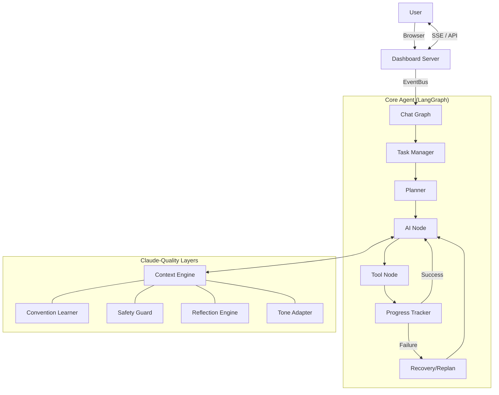

# PulseAI (PulseCodeAI)

PulseAI is an autonomous senior-engineer agent built with LangGraph and LangChain. It features a "Claude-Quality" ecosystem, a real-time Agentic IDE dashboard, and a layered context engine designed for high-precision autonomous coding.

---

## 🧠 The Claude-Quality Transformation

PulseAI follows a 6-step transformation to ensure professional, safe, and high-quality outputs:

1. **Persona Injection:** Warm, professional, and thoughtful senior engineer tone.
2. **Thinking & Polish:** Explicit `think()` reasoning steps before actions.
3. **Tone & Persistence:** Adapts tone to task complexity; memories persist in `~/.pulseai/`.
4. **Conventions & Safety:** `ConventionLearner` auto-detects your project DNA; `SafetyGuard` protects against risky actions.
5. **Reflection & Compression:** `ReflectionEngine` harvests permanent lessons; `SmartCompressor` manages long-term semantic memory.
6. **Ecosystem Layer:** `CostRouter` for multi-tier model selection and `SubAgentCoordinator` for specialized tasks.

---

## 🖥️ Agentic IDE Dashboard

PulseAI includes a real-time web interface (**Agentic IDE**) with a red-neon EKG branding.

- **Live Streaming:** Watch the agent's thought process and tool calls via SSE.
- **Interactive Chat:** Communicate with the agent directly from the browser.
- **Tool Approval:** Manually approve or deny sensitive tool calls (file writes, terminal commands).
- **Real-time Analytics:** Track tokens, cost, and agent status live.

**To run the dashboard:**
```bash
python src/dashboard_server.py
```
Then open `http://localhost:8080`.

---

## ✨ Features

### Autonomous Coding Workflow
- **Planning:** Generates multi-step execution plans before acting.
- **Execution:** Modifies files, runs terminal commands, and performs web searches.
- **Recovery:** Automatically detects and recovers from tool or terminal failures.
- **Replanning:** Pivot strategy mid-task if the current plan becomes unviable.

### Layered Context Engine
PulseAI builds a 15-layer context for every LLM call, including:
- Repo Map & Task context
- Plan & Progress tracking
- Recovery & Replan history
- Tone & Quality guidelines
- Project Conventions (auto-learned)

### Long-Term Memory
- **Persistent Memories:** Past task results and lessons are stored in `~/.pulseai/memories.json`.
- **Reflections:** Learned behaviors and "don't-do-this" lessons are indexed via `ReflectionEngine`.
- **Skills:** Frequently used command patterns or workflows are saved to `skills.json`.

### Web Search & Intelligence
- **Integrated Search:** Uses `ddgs` for real-time documentation and error lookups.
- **Web Fetch:** Reads full page content to verify implementation details.

---

## 🏗️ Architecture



---

## 📁 Project Structure

```text
PulseAIRepo/
├── src/
│   ├── main.py                     # CLI Entrypoint
│   ├── dashboard_server.py         # Web IDE Backend
│   ├── agents/                     # Specialist agents (Planner, SubAgent)
│   ├── context/                    # Context, Memory, Safety, and Tone layers
│   │   ├── safety_guard.py         # Human-in-the-loop approval logic
│   │   ├── reflection_engine.py    # Learning from past mistakes
│   │   ├── convention_learner.py   # Style matching logic
│   │   └── ...
│   ├── graphs/                     # LangGraph workflow definitions
│   ├── providers/                  # Multi-LLM provider support (Groq, OpenAI, Gemini)
│   ├── tests/                      # Extensive regression suite
│   └── tools/                      # File, Terminal, Web, and Math tools
├── dashboard.html                  # Agentic IDE Frontend
├── pyproject.toml                  # Dependencies & Project Meta
└── uv.lock
```

---

## ⚙️ Configuration

Copy the example environment file and set your keys:
```bash
cp .env.example .env
```

**Custom Provider Example:**
```env
LLM_PROVIDER=custom
CUSTOM_BASE_URL=https://your-api-url/v1
CUSTOM_API_KEY=sk-your-key
```

---

## 🧪 Testing

PulseAI maintains a high-stability regression suite.

**Run All Tests:**
```bash
export PYTHONPATH=$PYTHONPATH:.
python src/tests/test_agent_regression.py
```

**Key Test Modules:**
- `test_planner_manual`: Verifies plan generation logic.
- `test_replan_graph`: Verifies mid-task strategy shifts.
- `test_event_bus`: Verifies dashboard streaming reliability.
- `test_plan_approval`: Verifies human-in-the-loop approval.

---

## 🛡️ Safety Guard

PulseAI classifies every tool call. If a tool is marked as **destructive** (e.g., `write_file`, `run_terminal`), the agent pauses and waits for user approval via the Dashboard or CLI. This prevents the agent from making unwanted changes without oversight.

---

## 🗺️ Roadmap

- [x] 6-Step Claude-Quality Transformation
- [x] Agentic IDE Dashboard (Red Neon)
- [x] Multi-agent Collaboration Layer (Step 7)
- [ ] Automated README sync based on `ConventionLearner`
- [ ] Persistent SQLite Vector Memory
- [ ] Per-session cost reports in PDF format
