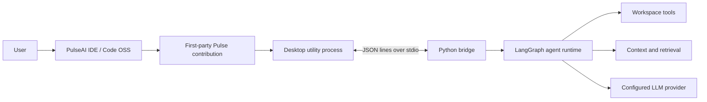

# PulseAI IDE

PulseAI IDE is a Code OSS fork with a first-party autonomous coding agent named **Pulse**. The repository contains the desktop IDE, the Python agent runtime, the versioned stdio bridge between them, and a browser-based UI lab used to develop and verify Pulse surfaces.

> **Project status:** active prototype. The runtime and desktop integration have broad regression coverage, but this is not yet a production-ready multi-user service. The legacy web dashboard is intended for trusted local development only.

## What is in this repository

| Area | Path | Purpose |
|---|---|---|
| Desktop IDE | `desktop/vscode/` | Vendored Code OSS fork with PulseAI branding and the first-party Pulse workbench contribution |
| Pulse contribution | `desktop/vscode/src/vs/workbench/contrib/pulseai/` | Agent panel, manager, tool rendering, workbench host, and desktop sidecar integration |
| Agent runtime | `src/` | LangGraph workflow, tools, context engine, safety gates, provider routing, persistence, and verification |
| Desktop bridge | `src/bridge/` | Versioned newline-delimited JSON protocol over stdio |
| UI Lab | `ui/` | Browser-testable SolidJS renderer and deterministic demo host; development tooling, not a separate product |
| Reliability benchmark | `benchmarks/` | Scenario contracts, drivers, grading, and report generation |
| Tests | `src/tests/` and `ui/tests/` | Runtime, bridge, desktop-boundary, branding, and UI regression coverage |
| Design and engineering docs | `docs/` | Current architecture, roadmap, benchmark, and design decisions |

## Current product behavior

### PulseAI IDE

- Pulse is available in the right auxiliary bar.
- **Ctrl/Cmd+L** opens the Pulse agent panel.
- A top-level **Pulse** menu and title-bar entry expose the primary commands.
- The desktop host binds each session to the currently opened workspace.
- A desktop utility process starts the Python bridge without importing Electron APIs into web builds.
- Tool calls, usage receipts, approvals, errors, and run state have first-party renderers.
- The composer selects a real runtime mode: **Agent** executes the guarded workflow, **Plan** previews without executing, **Debug** diagnoses before minimal repair and retesting, and **Ask** answers without tools.
- Built-in Copilot UI is hidden by default without deleting its source. It can be restored with the Pulse setting/command.
- **PulseAI Dark** is the bundled default theme.

### Agent runtime

- Plan, execute, recover, replan, and finalize workflow built on LangGraph.
- Session-scoped cancellation, steering, queues, checkpointing, and provider retries.
- Workspace-safe file and terminal tools with approval and mutation controls.
- Verification gates for changed code, including syntax, type-check, test, UI evidence, and unresolved local dependency/source-reference checks.
- Task-aware bounded context assembly, repository maps, hybrid chunk retrieval, landed-write payload compaction, and a bounded verification reserve within the existing token/iteration ceilings.
- Lazy persistent memory with local embedding cache only by default; graph import never downloads a model.
- Parallel tool execution with conflict detection and deterministic fallback.
- Lazy, workspace-pinned access to read-only native Code OSS intelligence: editor context, dirty text, diagnostics, symbols, definitions, references, search, SCM, and trust. Mutation/extension/MCP host invocation remains gated for later phases.
- Multi-provider support for Groq, OpenAI-compatible endpoints, Gemini, and NVIDIA.
- Reliability benchmark drivers for deterministic echo, real bridge, and CDP-controlled IDE runs.
- Interactive sessions ask before guarded mutations; explicitly headless benchmark sessions can use a workspace-scoped approval policy and still fail closed for sensitive, escaping, warned, or non-file operations.

Some semantic-memory features intentionally degrade to heuristics when local embeddings are unavailable or disabled. Provider-backed runs require a configured API key and network access.

> **Reliability status (2026-08-27):** Attempts 11 and 12 remain immutable end-to-end product **FAIL** evidence; later repairs do not reclassify those historical runs. Accepted provider-free Windows evidence `1b7ce9e1` validates the bounded verification, context-compaction, and source-integrity repair (183/183 focused and 7/7 protocol tests, zero provider traffic). Native-capability evidence `fc26086a` passed its deterministic checks, and final Agent/Manager CDP evidence `43cf8296` passed the shared desktop renderer and responsive Manager flow. Four-mode desktop evidence `1a6451bc` subsequently passed 65/65 focused tests, all typecheck/layer/compile checks, and 16/16 raw-CDP checks for the functional Agent, Plan, Debug, and Ask selector. All of these validations made zero provider requests. See the [phased agent-strengthening plan](docs/PULSE_AGENT_STRENGTHENING_PLAN.md), [Agent UI adaptation](docs/PULSE_AGENT_UI_ADAPTATION.md), [Attempt-11 independent review](docs/TEST5_ATTEMPT11_REVIEW.md), and [product-delivery repair](docs/ATTEMPT11_PRODUCT_DELIVERY_REPAIR.md). Historical evidence remains immutable; provider-backed retries remain unauthorized.

## Requirements

### Python runtime

- Python **3.11 or newer** (`.python-version` currently pins 3.14 for uv-managed development)
- [uv](https://docs.astral.sh/uv/) recommended

### UI Lab

- Node.js compatible with Vite 7
- npm

### Desktop IDE

The vendored Code OSS checkout has its own toolchain requirements. Use the Node version in `desktop/.nvmrc` and expect the initial dependency install/build to be large. See [`desktop/README.md`](desktop/README.md).

## Quick start: agent runtime

1. Install dependencies:

   ```bash
   uv sync --group dev
   ```

2. Create local configuration:

   ```bash
   cp .env.example .env
   ```

3. Select a provider and add only the corresponding key to `.env` or your shell environment:

   ```env
   LLM_PROVIDER=groq
   LLM_MODEL=qwen/qwen3.6-27b
   GROQ_API_KEY=your-key
   ```

4. Start the CLI:

   ```bash
   uv run python -m src.main
   ```

Do not commit `.env` or credentials. `.env.example` contains placeholders only.

### OpenAI-compatible custom endpoint

```env
LLM_PROVIDER=custom
LLM_MODEL=your-model-id
CUSTOM_BASE_URL=https://your-endpoint.example/v1
CUSTOM_API_KEY=your-key
```

## Run the bridge

The desktop sidecar communicates with the runtime over newline-delimited JSON on stdin/stdout:

```bash
uv run python -m src.bridge
```

Protocol definitions live in:

- `src/bridge/protocol_v2.json` — canonical schema
- `src/bridge/protocol.py` — Python protocol helpers
- `desktop/vscode/src/vs/workbench/contrib/pulseai/common/pulseAIProtocol.generated.ts` — generated desktop mirror

Do not hand-edit the generated TypeScript protocol mirror.

## Run the UI Lab

```bash
cd ui
npm ci
npm run dev
```

The lab provides Agent UI, Agent Manager, and a development-only Tool Gallery. It uses deterministic replay data and does not replace the desktop integration.

Useful checks:

```bash
npm run build
npm run check:desktop-syntax
npm run test:ui
```

Playwright browser binaries may need to be installed once:

```bash
npx playwright install
```

## Build the desktop IDE

Follow [`desktop/README.md`](desktop/README.md). The standard flow begins with:

```bash
cd desktop/vscode
npm install
npm run typecheck-client
npm run valid-layers-check
npm run compile
```

Build outputs and `node_modules` must remain untracked.

## Test the Python runtime

Run the repository suite from the root:

```bash
uv run python -m pytest src/tests -q \
  --ignore=src/tests/test_session_engines.py \
  --basetemp=/tmp/pulseai-pytest
```

`test_session_engines.py` is excluded from the default command because it exercises heavier session-engine behavior separately. Use a temporary directory outside the repository so generated files do not alter git-aware tests.

Targeted smoke checks:

```bash
uv run python -m pytest \
  src/tests/test_bridge.py \
  src/tests/test_bridge_protocol_v2.py \
  src/tests/test_desktop_workspace_boundary.py \
  src/tests/test_pulseai_branding.py -q
```

The test count changes as coverage is added, so this README intentionally does not publish a stale fixed count. A green process exit is necessary but benchmark claims must also be checked against the preserved benchmark evidence.

## Legacy local dashboard

A legacy Flask dashboard remains available for runtime development:

```bash
uv run python src/dashboard_server.py
```

It is **not** the main PulseAI IDE interface. Treat it as local-only: it is not an authenticated, tenant-isolated control plane and should not be exposed to an untrusted network.

## Architecture



The desktop boundary is deliberate: browser/workbench code talks to a typed host contract, the desktop host owns native services and process management, and the Python bridge is the only runtime transport.

## Safety and verification

- Workspace paths are validated before file operations.
- Sensitive or destructive operations pass through safety policy and approval gates.
- Session cancellation is checked before model retries and tool execution.
- Mutations can create shadow checkpoints for recovery.
- Completion gates distinguish successful verification from failed, stale, skipped, or unavailable evidence.
- Secrets belong in `.env` or the operating-system environment, never in tracked files.

These controls reduce risk; they do not make arbitrary model-generated commands safe. Review permissions and diffs before using Pulse on important workspaces.

## Documentation map

- [`desktop/README.md`](desktop/README.md) — canonical fork and build invariants
- [`ui/README.md`](ui/README.md) — UI Lab workflow and renderer boundaries
- [`docs/P2-roadmap.md`](docs/P2-roadmap.md) — product milestones and approved amendments
- [`docs/PULSEAI_IDE_CONTRIB_ARCHITECTURE.md`](docs/PULSEAI_IDE_CONTRIB_ARCHITECTURE.md) — first-party workbench architecture
- [`docs/DESIGN/FORK_REBRANDING.md`](docs/DESIGN/FORK_REBRANDING.md) — branding and discoverability decisions
- [`docs/HARNESS_STATUS.md`](docs/HARNESS_STATUS.md) — benchmark harness status
- [`docs/TEST5_READINESS.md`](docs/TEST5_READINESS.md) — Test-5 evidence and current stop status
- [`docs/AGENT_RELIABILITY_PLAN.md`](docs/AGENT_RELIABILITY_PLAN.md) — evidence-led runtime repair plan required before Agent UI work
- [`docs/OUTPUT_LIMIT_RECOVERY_REPAIR.md`](docs/OUTPUT_LIMIT_RECOVERY_REPAIR.md) — deterministic Attempt-10 finish-reason, continuation, telemetry, and runner repair
- [`docs/TEST5_ATTEMPT11_REVIEW.md`](docs/TEST5_ATTEMPT11_REVIEW.md) — independent live recovery, completion-integrity, and product review
- [`docs/ATTEMPT11_COMPLETION_REPAIR.md`](docs/ATTEMPT11_COMPLETION_REPAIR.md) — deterministic completion verdict, event pairing, terminal encoding, and metadata follow-up
- [`docs/TEST5_ATTEMPT11_WINDOWS_VALIDATION_REVIEW.md`](docs/TEST5_ATTEMPT11_WINDOWS_VALIDATION_REVIEW.md) — independent classification of the 142/145 Windows result and follow-up
- [`docs/TEST4_PASS_FORENSIC.md`](docs/TEST4_PASS_FORENSIC.md) — why Test 4's repaired product passed while its autonomous run remained partial
- [`CTO_AUDIT_PulseAI.md`](CTO_AUDIT_PulseAI.md) and [`ARCHITECTURE_REVIEW.md`](ARCHITECTURE_REVIEW.md) — historical audits; verify dates before treating recommendations as current

## Development rules

- Preserve the vendored Code OSS upstream boundary documented in `desktop/README.md`.
- Keep Pulse workbench code under `contrib/pulseai/`, not under `/extensions/`.
- Do not edit generated protocol or generated theme files by hand.
- Add regression coverage for bug fixes.
- Keep credentials, build outputs, benchmark runs, and large generated artifacts out of Git.
- Prefer fixing regressions in existing behavior over expanding scope without an approved roadmap change.

---

## Technical Assessment & Strategic Roadmap

**Perspective:** Software AI Engineer with expertise in DevOps, Agentic AI, TypeScript, and Desktop Application Building
**Date:** 2026-08-27

### Current Architecture Strengths

PulseAI has built a genuinely competitive foundation that outperforms many OSS alternatives:

1. **16-Layer Context Engine** — Task-aware context assembly with 60/30/10 relevance scoring (task-type prior / semantic similarity / recency), embedding deduplication at cosine > 0.88, hierarchical budget fitting, and differential caching. This is meaningfully better than "stuff everything in" OSS scaffolding.

2. **Chunked Code Index** — AST extraction → sqlite-vec KNN + FTS5 BM25 → RRF position fusion. This is the Cursor-gap closer that the architecture review identified, and it's been shipped with background indexing and atomic incremental sync.

3. **Session-Scoped Engines** — Per-thread-id engine registry with LRU eviction, per-engine API locks, and global feedback learning. Solved the critical singleton mutation bug that leaked state across sessions.

4. **Provider-Adaptive Budgets** — Dynamic context-window discovery with live provider probing, memoized resolution, and engine-proxy lockstep. The `PROVIDER_SAFE_LIMIT=0` auto-mode unlocks paid-tier scaling.

5. **Safety Architecture** — Workspace path validation, destructive operation approval gates, session cancellation checks, shadow checkpoints, and completion gates. The guard is a checkpoint, not a sandbox — correct design for an agent that needs to actually execute code.

6. **Reliability Benchmarking** — Scenario contracts, drivers, grading, and report generation with CDP-controlled IDE runs. Provider-free validation (183/183 focused tests, 65/65 pytest, 16/16 CDP) proves the runtime works without external dependencies.

### Critical Technical Gaps (Priority-Ordered)

#### 🔴 P1: Provider Strategy — The Latency/Cost Crisis

**Root cause:** The agent loop runs on FreeLLM, a rotating pool of free models with no prompt caching.

**Measured impact:**
- 25–56 seconds per agent step vs. 0.5–1.1s API round-trip
- 73% of prompt tokens are static overhead re-sent every call
- Weak parallel tool-calling (1 tool per turn after initial batch)
- 4 consecutive failed runs on the flagship chat-app task

**The math:** Free models cost more in aggregate (more calls, more tokens, failed re-runs) than a real provider with prompt caching. DeepSeek V3 with disk cache: 15k static prefix cached after call 1, subsequent calls at ~$0.07/M instead of $0.27/M.

**Recommendation:** Move agent loop to DeepSeek V3 or Claude Sonnet. Keep FreeLLM for auxiliary paths (summarization, self-curation). This single change fixes latency, cost, and batching.

#### 🟠 P2: Verification for Real — Runtime Proof, Not Typecheck

**Root cause:** `tsc --noEmit` passes while the app returns HTTP 500.

**Impact:** A slow-but-correct IDE can compete. An IDE that ships broken apps that *look* finished cannot.

**Recommendation:**
- UI tasks must prove real browser render (non-empty snapshot) before finalize
- Wire Puppeteer MCP suite as mandatory for UI tasks
- Keep `typecheck_workspace` for non-UI tasks
- Many failures will disappear with a stronger model (P1)

#### 🟠 P3: Architecture Debt — The God-File Problem

**Root cause:** `chat_graph.py` is 2,901 lines — a monolithic file handling the entire agentic loop.

**Impact:** The 148 KB / 54-section architecture review document is a symptom of patching faster than simplifying.

**Recommendation:**
- Freeze new features
- Split `chat_graph.py` into `nodes/` modules
- Pick one task ("build & verify a Next.js chat app, fast and correct") and converge until green, measured, and under budget
- Then expand

#### 🟡 P4: Desktop Fork Timing

**Root cause:** Forking Code OSS is the right end-state (Cursor did it), but doing it now is the classic startup sequencing mistake.

**Impact:** The 15k-file `desktop/` fork already blew up the repo-map builder (O(n²) bug causing 600s hangs).

**Recommendation:**
- **P0 (now):** Engine moat — chunked code index, hybrid retrieval, fix bugs #1–4
- **P1 (2-4 wks):** Harness quality — pytest + CI, eval harness, unified-diff apply
- **P2 (3-4 wks):** VSCode extension against stock VSCode (90% of API value, 10% of fork cost)
- **P3 (when proven):** Fork Code OSS when extension API limits are the actual blocker

#### 🟡 P5: Multi-Language Code Index

**Root cause:** Current chunk index is Python-only (stdlib AST). Multi-language requires tree-sitter grammars.

**Impact:** The agent can only index Python files natively.

**Recommendation:** Add tree-sitter grammars for JavaScript/TypeScript (already in deps), Go, Rust, Java. Ship as incremental expansion, not a blocker.

#### 🟡 P6: CI/CD Pipeline

**Root cause:** Tests exist (130+ passing) but aren't CI-gated.

**Impact:** No automated regression detection on PRs.

**Recommendation:** Add GitHub Actions workflow:
- Run pytest on PR
- Run typecheck-client, valid-layers-check, compile for desktop
- Run UI build and test:ui
- Gate merge on all checks passing

### DevOps Recommendations

1. **Containerization:** Dockerize the Python runtime for consistent dev/prod environments
2. **Monitoring:** Add OpenTelemetry tracing for agent steps (latency, token usage, cache hit rates)
3. **Feature Flags:** Toggle provider strategies, verification gates, and experimental features without redeployment
4. **Secrets Management:** Move from `.env` files to HashiCorp Vault or cloud KMS for production
5. **Infrastructure as Code:** Terraform/Pulumi for cloud deployment (when ready)

### Agentic AI Insights

1. **Prompt Caching is Non-Negotiable:** The 73% static overhead re-sent every call is the single biggest cost/latency driver. Any provider without caching is a non-starter for production.

2. **Parallel Tool Execution Needs Enforcement:** Don't depend on the model to batch. The plan-then-execute pattern (emit all independent writes as one forced assistant turn) is more reliable than hoping the model cooperates.

3. **Verification Must Be Runtime, Not Static:** Type checking catches syntax, not semantics. Browser render verification, API response validation, and integration tests are mandatory for UI/UX tasks.

4. **Session Isolation is Critical:** The singleton mutation bug (leaking state across sessions) would be catastrophic in production. The per-thread-id engine registry is correct architecture.

5. **Cost Transparency is a Feature:** The cost router (cheap/standard/premium tiers) and token tracking are genuine differentiators. Expose this to users — they'll pay for visibility.

### TypeScript/Desktop Application Perspective

1. **VSCode Extension First:** Package PulseAI as an extension against stock VSCode before forking. Webview chat (reuse dashboard.html), file-change feed → index refresh, diagnostics → context.

2. **Protocol Versioning:** The versioned newline-delimited JSON bridge is solid. Keep it. The generated TypeScript mirror ensures type safety across the boundary.

3. **Theme System:** PulseAI Dark as default is good. Ensure theme tokens are design-system aligned for future customization.

4. **Performance:** Electron apps are memory-hungry. Profile the desktop host process and utility process separately. Consider process-per-workspace for isolation.

### Next Milestone Recommendation

**Converge on one task:** "Build and verify a Next.js chat app, fast and correct."

- Switch to DeepSeek V3 with prompt caching (P1)
- Wire Puppeteer verification for UI tasks (P2)
- Measure: latency per step, cache hit rate, cost per task, success rate
- Get it green, measured, and under budget
- Then expand scope

The bones are good. The brain is the problem. Fix the provider strategy and the rest of this stack finally gets to show what it can do.
