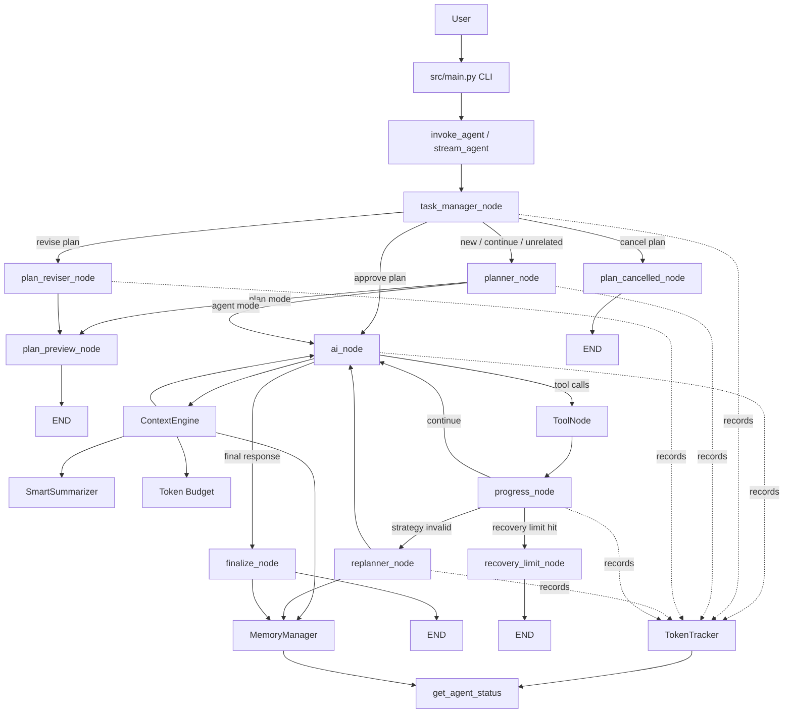

# PulseCodeAI

PulseCodeAI is an autonomous AI coding agent built with LangGraph and LangChain. It can inspect a workspace, create or edit files, run terminal commands, recover from failures, create execution plans, revise plans, and track its own progress, memory, and token usage.

The project has evolved from a basic coding assistant into a stateful agent with planning, recovery, context management, long-term memory, and cost visibility.

---

## Features

### Agent execution

- Autonomous coding workflow
- File inspection and modification tools
- Terminal execution tools
- Tool-result based progress tracking
- Recovery from failed tool calls or failed terminal commands
- Replanning when the current strategy is no longer viable

### Plan Mode

- Preview an execution plan before any tool runs
- Approve a plan to execute it
- Revise a plan before approval
- Cancel a pending plan safely
- Prevent cancelled plans from being accidentally resumed

### Context Engine

- Builds clean layered context instead of one giant prompt blob
- Separates task, plan, progress, recovery, replan, memory, and history layers
- Trims old messages to stay under token budget
- Summarizes long tool outputs before sending them back to the AI

### Smart Summaries

- Compresses large file reads, terminal output, search results, and directory listings
- Uses fast heuristic summaries by default
- Supports optional LLM-powered summarization for very large outputs

### Vector Memory

- Stores task completions and replan lessons in long-term memory
- Retrieves relevant past memories for similar future tasks
- Uses a free in-memory embedding fallback by default
- Designed to be replaceable with persistent storage or a real vector DB later

### Token Usage Tracking

- Tracks prompt tokens, completion tokens, total tokens, calls, and estimated cost
- Tracks LLM calls from the planner, replanner, task classifier, replan classifier, and main AI node
- Exposes usage in agent status
- Adds a `/cost` CLI command

---

## Architecture Diagram



---

## High-Level Flow

```text
User
  ↓
src/main.py
  ↓
chat_graph.py
  ↓
task_manager_node
  ↓
planner_node or ai_node
  ↓
ContextEngine builds layered context
  ↓
LLM decides next action
  ↓
ToolNode runs file/terminal tools if needed
  ↓
progress_node records success/failure
  ↓
recover, replan, continue, or finalize
```

---

## Project Structure

```text
.
├── main.py                         # Root entrypoint wrapper
├── src/
│   ├── main.py                     # Interactive CLI
│   ├── agents/
│   │   ├── agent_status.py         # Agent status snapshots
│   │   └── planner.py              # Planner/replanner/reviser logic
│   ├── config/
│   │   └── settings.py             # Environment-driven configuration
│   ├── context/
│   │   ├── context_engine.py       # Layered context builder
│   │   ├── memory_manager.py       # Long-term memory business logic
│   │   ├── summarizer.py           # Tool output summarization
│   │   ├── token_budget.py         # Token counting and trimming
│   │   ├── token_tracker.py        # Token/cost accounting
│   │   └── vector_memory.py        # In-memory vector search
│   ├── graphs/
│   │   ├── basic_graph.py          # Simple graph example
│   │   └── chat_graph.py           # Main LangGraph agent
│   ├── llm/
│   │   └── factory.py              # Provider/model factory with retry wrapper
│   ├── models/
│   │   └── plan_models.py          # Plan Pydantic models
│   ├── prompts/
│   │   └── planner_prompt.py       # Planner prompt
│   ├── providers/                  # Provider-specific examples
│   ├── tests/                      # Regression tests
│   └── tools/                      # File, math, and terminal tools
├── generated/                      # Test/generated files
├── pyproject.toml
└── uv.lock
```

---

## Configuration

The model/provider configuration is environment-driven. Copy the example file and fill in the values for your provider:

```bash
cp .env.example .env
```

Example for a custom OpenAI-compatible provider:

```env
LLM_PROVIDER=custom
LLM_MODEL=auto/cheap
CONTEXT_MODEL=auto/cheap

CUSTOM_BASE_URL=https://your-openai-compatible-host/v1
CUSTOM_API_KEY=your_key_here
```

Example for Groq:

```env
LLM_PROVIDER=groq
LLM_MODEL=qwen/qwen3.6-27b
CONTEXT_MODEL=qwen/qwen3.6-27b

GROQ_API_KEY=your_key_here
```

Supported providers in `src/llm/factory.py`:

- `groq`
- `gemini`
- `nvidia`
- `openai`
- `custom`

> Do not commit real API keys. `.env` is ignored by git.

---

## Install

Using `uv`:

```bash
uv sync
```

Or using `pip`:

```bash
python -m pip install -e .
```

If editable install is not desired, install the dependencies from `pyproject.toml` with your preferred Python environment manager.

---

## Run the Agent

```bash
python -m src.main
```

Or:

```bash
python src/main.py
```

CLI commands:

```text
/model
/model <provider> <model>
/cost
exit
quit
```

Example:

```text
You: Create generated/hello.py that prints hello, run it, and verify the output.
```

After each turn, the CLI prints token usage when available:

```text
[Usage] Tokens: 7,050 in + 860 out = 7,910 total | Cost: $0.000791 | Calls: 2
```

---

## Run Tests

Regression suite:

```bash
python -m src.tests.test_agent_regression
```

Individual examples:

```bash
python -m src.tests.test_planner_manual
python -m src.tests.test_replanner_manual
python -m src.tests.test_replan_graph
python -m src.tests.test_plan_mode
python -m src.tests.test_plan_approval
python -m src.tests.test_plan_revision
python -m src.tests.test_plan_cancel
python -m src.tests.test_keep_recovery
python -m src.tests.test_replan_recovery
```

Current verified status:

```text
Passed: 9
Failed: 0
Total:  9

ALL REGRESSION TESTS PASSED
```

---

## Agent Status

`get_agent_status(thread_id)` returns a read-only snapshot of the saved LangGraph thread state.

It includes:

- current task
- high-level status
- plan progress
- active step
- last tool action
- recovery state
- replan state
- failure summary
- execution trace count
- stored memory count
- token/cost usage

Example shape:

```python
{
    "task": "Create generated/hello.py and run it",
    "status": "completed",
    "plan": {
        "total": 3,
        "completed": 3,
        "active_step": None,
        "steps": [...],
    },
    "recovery": {
        "active": False,
        "attempts": 0,
        "limit": 3,
    },
    "replan": {
        "needed": False,
        "count": 0,
        "limit": 2,
    },
    "memory": {
        "stored_memories": 2,
    },
    "cost": {
        "prompt_tokens": 7050,
        "completion_tokens": 860,
        "total_tokens": 7910,
        "estimated_cost_usd": 0.000791,
        "calls_made": 2,
    },
}
```

---

## Current Capabilities

| Area | Status |
|---|---:|
| Planning | ✅ |
| Plan preview mode | ✅ |
| Plan approval | ✅ |
| Plan revision | ✅ |
| Plan cancellation | ✅ |
| Tool execution | ✅ |
| Recovery | ✅ |
| Replanning | ✅ |
| Context budgeting | ✅ |
| Smart summaries | ✅ |
| Vector memory | ✅ |
| Token/cost tracking | ✅ |
| Regression tests | ✅ 9/9 |

---

## Notes and Limitations

- Vector memory is currently in-memory only. It resets when the process restarts.
- Token cost is estimated unless the provider returns usage metadata.
- The custom provider must be OpenAI-compatible.
- Cheap/auto-routed models can sometimes return inconsistent classifications, so the planner includes deterministic fallbacks for obvious multi-step coding tasks.
- The LLM factory includes retry handling for transient rate limits and some custom-provider routing errors.

---

## Roadmap Ideas

- Persist vector memory to disk
- Replace simple embeddings with a real embedding model
- Add ChromaDB or another vector database
- Add a UI dashboard for live agent status
- Add per-session and lifetime cost reports
- Add memory editing/deletion commands

---

## Development Milestone

PulseCodeAI now has:

- stable planning and recovery
- safe plan workflows
- observability through status snapshots
- smart context management
- long-term memory
- token/cost tracking
- full regression coverage passing

This is now a solid foundation for building an IDE-integrated autonomous coding agent.
