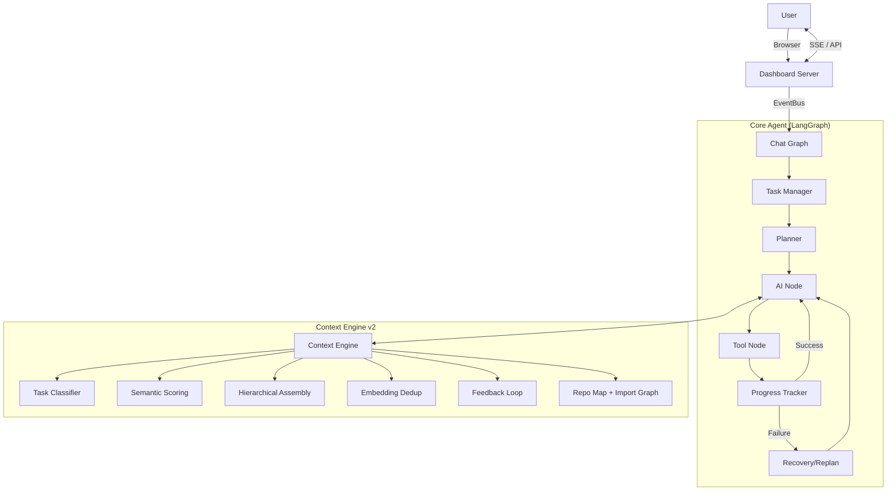

# PulseAI (PulseCodeAI)

PulseAI is an autonomous senior-engineer agent built with LangGraph and LangChain. It features a "Claude-Quality" ecosystem, a real-time Agentic IDE dashboard, and a task-aware context engine designed for high-precision autonomous coding.

---

## 🧠 The Claude-Quality Transformation

PulseAI follows a 6-step transformation to ensure professional, safe, and high-quality outputs:

1. **Persona Injection:** Warm, professional, and thoughtful senior engineer tone.
2. **Thinking & Polish:** Explicit `think()` reasoning steps before actions.
3. **Tone & Persistence:** Adapts tone to task complexity; memories persist in `~/.pulseai/`.
4. **Conventions & Safety:** `ConventionLearner` auto-detects your project DNA; `SafetyGuard` protects against risky actions.
5. **Reflection & Compression:** `ReflectionEngine` harvests permanent lessons; `SmartCompressor` manages long-term semantic memory.
6. **Ecosystem Layer:** `CostRouter` for multi-tier model selection and `SubAgentCoordinator` for specialized tasks.

---

## 🖥️ Agentic IDE Dashboard

PulseAI includes a real-time web interface (**Agentic IDE**) with a red-neon EKG branding.

- **Live Streaming:** Watch the agent's thought process and tool calls via SSE.
- **Interactive Chat:** Communicate with the agent directly from the browser.
- **Tool Approval:** Manually approve or deny sensitive tool calls (file writes, terminal commands).
- **Real-time Analytics:** Track tokens, cost, and agent status live.

**To run the dashboard:**
```bash
python src/dashboard_server.py
```
Then open `http://localhost:8080`.

---

## ✨ Features

### Autonomous Coding Workflow
- **Planning:** Generates multi-step execution plans before acting.
- **Execution:** Modifies files, runs terminal commands, and performs web searches.
- **Recovery:** Automatically detects and recovers from tool or terminal failures.
- **Replanning:** Pivot strategy mid-task if the current plan becomes unviable.

### Task-Aware Context Engine (v2)
PulseAI builds a 16-layer context for every LLM call. Unlike v1 (static order, fixed budget), v2 is task-aware:

- **Task Classification:** Regex heuristics + embedding similarity classify each task into 9 types (debug, create, refactor, test, explore, explain, plan, recovery, chat).
- **Relevance Scoring:** Every layer is scored `60% task-type prior + 30% semantic similarity + 10% recency`; low-value layers are skipped entirely.
- **Hierarchical Assembly:** Layers are packed into a token budget highest-relevance-first; oversized layers are compressed rather than dropped.
- **Semantic Dedup:** Embedding near-duplicate detection (cosine > 0.88) removes redundant layers.
- **Differential Caching:** Layers are only rebuilt when non-message state changes.
- **Semantic History Compression:** `SmartCompressor` scores each past message by similarity to the current task (plus type/recency heuristics), not just age.
- **Feedback Loop:** Completed tasks record which layers were used; layer weights drift ±3% toward successful compositions.

### Long-Term Memory
- **Persistent Memories:** Past task results and lessons are stored in `~/.pulseai/memories.json`.
- **Vector Memory:** Semantic store (sentence-transformers embeddings) for preferences, reflections, and tool outputs — **SQLite-backed at `~/.pulseai/vector_memory.db`, survives restarts**.
- **Reflections:** Learned behaviors and "don't-do-this" lessons are indexed via `ReflectionEngine`.
- **Skills:** Frequently used command patterns or workflows are saved to `skills.json`.

### Web Search & Intelligence
- **Integrated Search:** Uses `ddgs` for real-time documentation and error lookups.
- **Web Fetch:** Reads full page content to verify implementation details.

---

## ⚖️ v2 vs v1: The Honest Diff

Everything below was verified by running both versions — v2 (`ae04d77`) is the better engine. Not because it's newer, but because it fixes concrete v1 weaknesses:

| Area | v1 (previous commit) | v2 (current) | Verdict |
|---|---|---|---|
| Task awareness | Same 15 layers, same order, every call | Task classified into 9 types; per-type relevance & budgets | **v2** — v1 wasted tokens on irrelevant layers |
| Context budgeting | Static split; steal from history when over | Type-specific ratios + hierarchical fit + per-layer compression | **v2** |
| History trimming | Heuristic scoring (type + recency) | Semantic similarity to current task + heuristics | **v2** |
| Embeddings | `SimpleEmbedding` — hash bag-of-words, no meaning | `all-MiniLM-L6-v2` — real semantics, shared singleton | **v2** |
| Repo map symbols | Regex (`^def`/`^class`), missed async/decorators | AST-based, handles async + decorators, lists imports | **v2** |
| Import graph | None | AST import graph (top 20 files × 5 imports) | **v2** |
| Repo map compression | Stripped every ` -> ` line — silently killed symbols *and* the import graph | Preserves the import graph through compression | **v2** (bug fixed) |
| Dedup | None | Embedding near-duplicate removal (0.88 threshold) | **v2** |
| Feedback | None | Records completions, adjusts layer weights | v2 (partial — see caveats) |

### Verified caveats (read before believing the hype)

1. **Feedback is coarse, not attributed.** Success/failure is recorded from `finalize_node`, `recovery_limit_node`, and `replan_node`. The loop shifts layer weights ±3%, but `record_feedback` snapshots the live layer cache, which is empty outside `build_ai_messages` — so it can't yet attribute an outcome to *which* layers matter. It learns that failure happened, not why. (Verified working; the attribution gap is next.)
2. **Embedder cold-start is heavy.** First load takes ~30s and downloads ~100MB (`all-MiniLM-L6-v2`, CPU). If it fails, classifier, compressor, and dedup all fall back to heuristics — which is by design, but the semantic features silently downgrade.
3. **Import graph is a hint, not a graph.** 20 files × 5 imports, top-level modules only — no transitive deps, no call sites.
4. **Chunk retrieval exists but is narrow.** `chunk_index.py` (sqlite-vec KNN + FTS5 BM25 → RRF) is wired into ContextEngine as `relevant_chunks` for DEBUG/CREATE/REFACTOR tasks; other task types still assemble at layer granularity.
5. **SQLite search is a LINEAR scan.** `search()` scores the most recent 500 rows in Python — correct and persistent, but not a real vector index. Time to scale past ~10K memories.
6. **The pre-send guard covers messages, not tool defs.** `RetryLLMProxy` trims the message list to `PROVIDER_SAFE_LIMIT` (default 6000), but `bind_tools` payloads ride along untouched — a 50-tool definition list can still push a request over a tight provider limit.

---

## 🆚 Can It Compete With Cursor? (The Straight Answer)

**What's genuinely strong:**
- Task-aware, budget-bounded context assembly with semantic scoring beats the naive "stuff everything in" approach most OSS agents use. Tokens go to relevant layers.
- AST-accurate repo map with import graph + semantic dedup gives solid structural grounding per call.
- Zero-cost local embeddings — no API spend for context features.
- Differential caching means the heavy work happens once, not every turn.

**What Cursor has that this does not (yet):**
- A real codebase index: per-symbol/chunk embeddings, hybrid BM25 + vector retrieval, refreshed incrementally as files change. PulseAI has a static tree snapshot + a 20-file import graph.
- Code-chunk-level retrieval. The agent currently reads whole files; Cursor retrieves the *relevant* function/class.
- LSP/editor integration, `@`-references, git-aware context.
- A 200K-token model window with automatic file inclusion. PulseAI budgets a fixed `max_tokens` with heuristic ratios.

*Note: persistent vector memory is solved (SQLite at `~/.pulseai/vector_memory.db`) — the remaining gap is a proper *index* (chunk embeddings + BM25), not persistence.*

**Bottom line:** the v2 context engine, repo map, and persistent memory are a credible foundation — above typical OSS agent scaffolding — but to genuinely compete with Cursor's codebase Q&A, the roadmap is: chunked code index + BM25 hybrid retrieval → incremental refresh. That is the next milestone, not a claim we make today.

---

## 🏗️ Architecture



---

## 📁 Project Structure

```text
PulseAIRepo/
├── src/
│   ├── main.py                     # CLI Entrypoint
│   ├── dashboard_server.py         # Web IDE Backend
│   ├── agents/                     # Specialist agents (Planner, SubAgent)
│   ├── context/                    # Context, Memory, Safety, and Tone layers
│   │   ├── context_engine.py       # Task-aware, budgeted context assembly
│   │   ├── chunk_index.py          # Chunked code index (sqlite-vec KNN + FTS5 BM25 → RRF)
│   │   ├── repo_map.py             # AST repo map + import graph
│   │   ├── smart_compressor.py     # Semantic history compression
│   │   ├── vector_memory.py        # In-memory semantic store
│   │   ├── safety_guard.py         # Human-in-the-loop approval logic
│   │   ├── reflection_engine.py    # Learning from past mistakes
│   │   ├── convention_learner.py   # Style matching logic
│   │   └── ...
│   ├── graphs/                     # LangGraph workflow definitions
│   ├── llm/factory.py              # LLM + shared embedder factory
│   ├── providers/                  # Multi-LLM provider support (Groq, OpenAI, Gemini)
│   ├── tests/                      # Regression suite
│   └── tools/                      # File, Terminal, Web, and Math tools
├── desktop/                        # VS Code fork (code-oss-dev 1.130.0) desktop app
├── dashboard.html                  # Agentic IDE Frontend
├── pyproject.toml                  # Dependencies & Project Meta
└── uv.lock
```

---

## ⚙️ Configuration

Copy the example environment file and set your keys:
```bash
cp .env.example .env
```

**Custom Provider Example:**
```env
LLM_PROVIDER=custom
CUSTOM_BASE_URL=https://your-api-url/v1
CUSTOM_API_KEY=sk-your-key
```

**Embeddings (optional, defaults are local + free):**
```env
EMBEDDING_PROVIDER=local          # local (sentence-transformers) | openai (not implemented yet)
EMBEDDING_MODEL=all-MiniLM-L6-v2
EMBEDDING_DEVICE=cpu              # cpu | cuda
```

---

## 🧪 Testing

PulseAI maintains a regression suite covering the graph, dashboard, and approval flows.

**Run All Tests:**
```bash
export PYTHONPATH=$PYTHONPATH:.
python src/tests/test_agent_regression.py
```

**Key Test Modules:**
- `test_planner_manual`: Verifies plan generation logic.
- `test_replan_graph`: Verifies mid-task strategy shifts.
- `test_event_bus`: Verifies dashboard streaming reliability.
- `test_plan_approval`: Verifies human-in-the-loop approval.

---

## 🛡️ Safety Guard

PulseAI classifies every tool call. If a tool is marked as **destructive** (e.g., `write_file`, `run_terminal`), the agent pauses and waits for user approval via the Dashboard or CLI. This prevents the agent from making unwanted changes without oversight.

---

## 🗺️ Roadmap

- [x] 6-Step Claude-Quality Transformation
- [x] Agentic IDE Dashboard (Red Neon)
- [x] Multi-agent Collaboration Layer
- [x] Task-aware Context Engine v2 (classification, scoring, budgets, dedup)
- [x] AST repo map + import graph
- [x] Tool-memory writer (semantic store of past tool outputs)
- [x] Persistent vector memory (SQLite, ~/.pulseai/vector_memory.db)
- [x] Failure feedback wired (recovery-limit, replan give-up, finalize)
- [x] Pre-send token guard (PROVIDER_SAFE_LIMIT, 503 mitigation — verified live)
- [x] Chunk-level code retrieval (sqlite-vec KNN + FTS5 BM25, RRF fusion — `src/context/chunk_index.py`, wired into ContextEngine as `relevant_chunks`)
- [ ] Layer attribution of feedback (record which layers were sent per task)
- [ ] Per-session cost reports in PDF format
/usr/bin/bash: line 7: C:/Users/Administrator/AppData/Local/hermes/cache/terminal/hermes-cwd-6275bbbba2d3.txt: Device or resource busy
