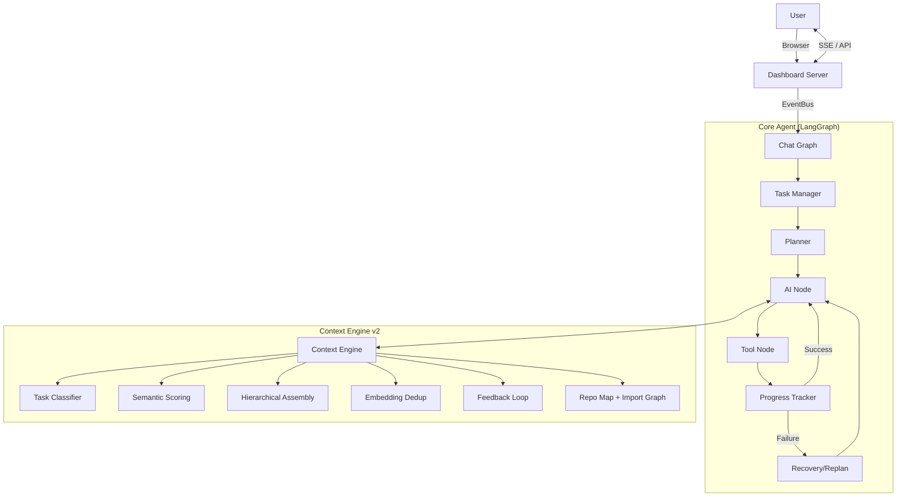
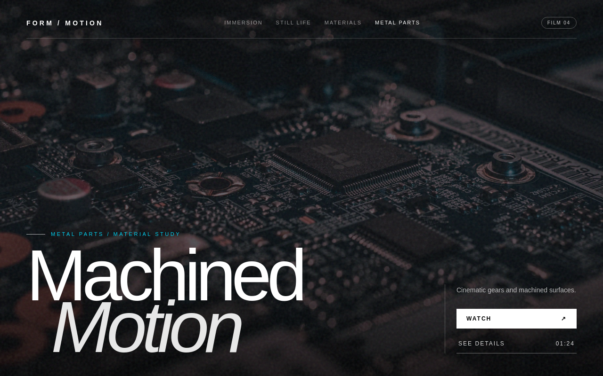

# PulseAI (PulseCodeAI)

PulseAI is an autonomous senior-engineer agent built with LangGraph and LangChain. It features a "Claude-Quality" ecosystem, a real-time Agentic IDE dashboard, and a task-aware context engine designed for high-precision autonomous coding.

---

## 🧠 The Claude-Quality Transformation

PulseAI follows a 6-step transformation to ensure professional, safe, and high-quality outputs:

1. **Persona Injection:** Warm, professional, and thoughtful senior engineer tone.
2. **Thinking & Polish:** Explicit `think()` reasoning steps before actions.
3. **Tone & Persistence:** Adapts tone to task complexity; memories persist in `~/.pulseai/`.
4. **Conventions & Safety:** `ConventionLearner` auto-detects your project DNA; `SafetyGuard` protects against risky actions.
5. **Reflection & Compression:** `ReflectionEngine` harvests permanent lessons; `SmartCompressor` manages long-term semantic memory.
6. **Ecosystem Layer:** `CostRouter` for multi-tier model selection and `SubAgentCoordinator` for specialized tasks.

---

## 🖥️ Agentic IDE Dashboard

PulseAI includes a real-time web interface (**Agentic IDE**) with a red-neon EKG branding.

- **Live Streaming:** Watch the agent's thought process and tool calls via SSE.
- **Interactive Chat:** Communicate with the agent directly from the browser.
- **Tool Approval:** Manually approve or deny sensitive tool calls (file writes, terminal commands).
- **Real-time Analytics:** Track tokens, cost, and agent status live.

**To run the dashboard:**
```bash
python src/dashboard_server.py
```
Then open `http://localhost:8080`.

---

## ✨ Features

### Autonomous Coding Workflow
- **Planning:** Generates multi-step execution plans before acting.
- **Execution:** Modifies files, runs terminal commands, and performs web searches.
- **Recovery:** Automatically detects and recovers from tool or terminal failures.
- **Replanning:** Pivot strategy mid-task if the current plan becomes unviable.

### Task-Aware Context Engine (v2)
PulseAI builds a 16-layer context for every LLM call. Unlike v1 (static order, fixed budget), v2 is task-aware:

- **Task Classification:** Regex heuristics + embedding similarity classify each task into 9 types (debug, create, refactor, test, explore, explain, plan, recovery, chat).
- **Relevance Scoring:** Every layer is scored `60% task-type prior + 30% semantic similarity + 10% recency`; low-value layers are skipped entirely.
- **Hierarchical Assembly:** Layers are packed into a token budget highest-relevance-first; oversized layers are compressed rather than dropped.
- **Semantic Dedup:** Embedding near-duplicate detection (cosine > 0.88) removes redundant layers.
- **Differential Caching:** Layers are only rebuilt when non-message state changes.
- **Semantic History Compression:** `SmartCompressor` scores each past message by similarity to the current task (plus type/recency heuristics), not just age.
- **Feedback Loop:** Completed tasks record which layers were used; layer weights drift ±3% toward successful compositions.

### Long-Term Memory
- **Persistent Memories:** Past task results and lessons are stored in `~/.pulseai/memories.json`.
- **Vector Memory:** Semantic store (sentence-transformers embeddings) for preferences, reflections, and tool outputs — **SQLite-backed at `~/.pulseai/vector_memory.db`, survives restarts**.
- **Reflections:** Learned behaviors and "don't-do-this" lessons are indexed via `ReflectionEngine`.
- **Skills:** Frequently used command patterns or workflows are saved to `skills.json`.

### Web Search & Intelligence
- **Integrated Search:** Uses `ddgs` for real-time documentation and error lookups.
- **Web Fetch:** Reads full page content to verify implementation details.

### Verification & Quality Gates (Test-2 hardening)
Code that ships must be *proven* sound — not believed sound:

- **Multi-language syntax receipt:** every `write_file`/`edit_file` on `.ts/.tsx/.js/.jsx/.json/.py` is parsed by a real compiler (esbuild for TS/TSX — zero phantom errors, unlike bare `tsc` on single files) before landing. A change that breaks a previously-valid file is rejected on the spot; already-broken files stay repairable.
- **`typecheck_workspace` tool:** runs the workspace's own `tsc --noEmit` (tsconfig-aware) and returns errors grouped by file. On the real Test-2 lab app it caught 25 type errors, including the `TS1005: '=>' expected` class the agent had shipped.
- **Verify gate:** an execution task that wrote code files cannot declare "Finished" until a verification tool ran **and passed** — a `typecheck_workspace` that *runs* but reports errors is treated as unverified and the agent is pushed (bounded, 2×) to fix every reported error and re-verify until ✅.

### Session Durability & Self-Maintenance (D-round)
Long-running sessions must survive retries, provider switches, and provider (mis)behavior — and keep the agent's memory/skills groomed between turns:

- **Pre-send request sanitizer (D36):** at the final pre-API chokepoint (`RetryLLMProxy.invoke`) the outgoing message list is cleaned losslessly — duplicate `tool_call` entries within one assistant message are collapsed, replayed/re-used `tool_call_id` results are dropped, and byte-identical tool results are deduped. Strict providers (e.g. DeepSeek) HTTP-400 a payload with a repeated `tool_call_id`; retries/crash-resume glitches used to produce exactly that.
- **Failover prompt-cache preservation (D37):** the static context prefix survives a provider failover byte-identical so provider prompt caches keep paying out (hermes doctrine). The split is unambiguous by design — a sentinel `VOLATILE_TAIL_PREAMBLE` message separates history from the volatile tail, so the split boundary is never sniffed from model output. The agent-guaranteed *service-ready* mode (`ai_mode=svc` / `tscore=1`) also survives tail routing and engine tint.
- **Post-turn self-curation review (D38):** after a run completes, a short daemon thread replays a digest of the conversation against a memory-review prompt on the janitor (aux) model and writes durable facts — the hermes background-review loop, bounded (one review per trigger per session, capped writes), aux-billed, and never allowed to raise into a turn.
- **Skill lifecycle (D39):** skills carry provenance (`created_by`: user vs agent), `pinned` status (exempt from every auto-transition), usage telemetry (`use_count` / `view_count` / `patch_count`), and a curator state machine (`active → stale → archived`) that only auto-manages **agent-created** skills, never deletes, and respects pins. `skills_manifest()` emits a compact byte-stable index.

### Efficiency (fewer calls, fewer tokens)
- **`execute_code` (PTC) batching:** the agent is taught to collapse multi-step exploration/checks into ONE script call instead of many separate tool calls — the direct fix for the Test-2 50-call pattern.
- **Parallel tool calls (hermes `PARALLEL_TOOL_CALL_GUIDANCE`):** independent reads, searches, and writes on different files are batched into ONE assistant turn — the runtime (`D34` gate) executes disjoint calls concurrently and orders conflicting writes deterministically, so N files cost ~1 round trip instead of N. Tool-call ids in a batch are repaired deterministically (`_uniquify_tool_call_ids`, hermes #58327) so a reused id can never silently lose a later result.
- **Execution discipline (hermes `TOOL_USE_ENFORCEMENT`, qwen-gated):** act, don't describe — every response either makes progress via tool calls or delivers a final result; when the choice is obvious, act instead of asking; keep calling tools until the task is complete **and** verified.
- **Grounding (hermes `OPENAI_MODEL_EXECUTION_GUIDANCE`, qwen-gated):** never answer facts (math, time, system state, file contents, git, live docs) from memory — always use a tool; missing context is looked up first, ask only when no tool can retrieve it, and assumptions are labeled.

### Autonomous safety (D11)
The `SafetyGuard` blocks **dangerous** operations, not the agent's own work:

- **`PULSEAI_AUTO_APPROVE_WRITES=1`** (autonomous/batch mode): ordinary file overwrites are allowed — the agent MUST be able to fix its own files. Critical paths (`.env`, secrets) and dangerous commands still block. Interactive sessions keep the human-approval prompt.
- **Per-call denial instead of batch rejection:** an unsafe call in a batch becomes a denial `ToolMessage` (model adapts in one turn) while the safe calls still execute — the old path rejected the whole batch and fabricated an approval-prompt `AIMessage` that dead-ended a session with no human, which was the measured root cause of the Test-2 1-call-per-turn collapse.
- **Tool-output summarization:** >8000-char tool outputs are summarized by the cheap auxiliary model (`SUMMARIZER_LLM=aux`), memoized per unique output so each big result costs one janitor-rate call, not one per turn.
- **Full context window:** `PROVIDER_SAFE_LIMIT=0` unlocks the model's real window (live-probed, margin-reserved) instead of the conservative 6000-token cap that starved the agent into blind re-discovery.

---

## ⚖️ v2 vs v1: The Honest Diff

Everything below was verified by running both versions — v2 (`ae04d77`) is the better engine. Not because it's newer, but because it fixes concrete v1 weaknesses:

| Area | v1 (previous commit) | v2 (current) | Verdict |
|---|---|---|---|
| Task awareness | Same 15 layers, same order, every call | Task classified into 9 types; per-type relevance & budgets | **v2** — v1 wasted tokens on irrelevant layers |
| Context budgeting | Static split; steal from history when over | Type-specific ratios + hierarchical fit + per-layer compression | **v2** |
| History trimming | Heuristic scoring (type + recency) | Semantic similarity to current task + heuristics | **v2** |
| Embeddings | `SimpleEmbedding` — hash bag-of-words, no meaning | `all-MiniLM-L6-v2` — real semantics, shared singleton | **v2** |
| Repo map symbols | Regex (`^def`/`^class`), missed async/decorators | AST-based, handles async + decorators, lists imports | **v2** |
| Import graph | None | AST import graph (top 20 files × 5 imports) | **v2** |
| Repo map compression | Stripped every ` -> ` line — silently killed symbols *and* the import graph | Preserves the import graph through compression | **v2** (bug fixed) |
| Dedup | None | Embedding near-duplicate removal (0.88 threshold) | **v2** |
| Feedback | None | Records completions, adjusts layer weights | v2 (partial — see caveats) |

### Verified caveats (read before believing the hype)

1. **Feedback is coarse, not attributed.** Success/failure is recorded from `finalize_node`, `recovery_limit_node`, and `replan_node`. The loop shifts layer weights ±3%, but `record_feedback` snapshots the live layer cache, which is empty outside `build_ai_messages` — so it can't yet attribute an outcome to *which* layers matter. It learns that failure happened, not why. (Verified working; the attribution gap is next.)
2. **Embedder cold-start is heavy.** First load takes ~30s and downloads ~100MB (`all-MiniLM-L6-v2`, CPU). If it fails, classifier, compressor, and dedup all fall back to heuristics — which is by design, but the semantic features silently downgrade.
3. **Import graph is a hint, not a graph.** 20 files × 5 imports, top-level modules only — no transitive deps, no call sites.
4. **Chunk retrieval exists but is narrow.** `chunk_index.py` (sqlite-vec KNN + FTS5 BM25 → RRF) is wired into ContextEngine as `relevant_chunks` for DEBUG/CREATE/REFACTOR tasks; other task types still assemble at layer granularity.
5. **SQLite search is a LINEAR scan.** `search()` scores the most recent 500 rows in Python — correct and persistent, but not a real vector index. Time to scale past ~10K memories.
6. **The pre-send guard covers messages, not tool defs.** `RetryLLMProxy` trims the message list to `PROVIDER_SAFE_LIMIT` (default 6000), but `bind_tools` payloads ride along untouched — a 50-tool definition list can still push a request over a tight provider limit.

---

## 🆚 Can It Compete With Cursor? (The Straight Answer)

**What's genuinely strong:**
- Task-aware, budget-bounded context assembly with semantic scoring beats the naive "stuff everything in" approach most OSS agents use. Tokens go to relevant layers.
- AST-accurate repo map with import graph + semantic dedup gives solid structural grounding per call.
- Zero-cost local embeddings — no API spend for context features.
- Differential caching means the heavy work happens once, not every turn.

**What Cursor has that this does not (yet):**
- A real codebase index: per-symbol/chunk embeddings, hybrid BM25 + vector retrieval, refreshed incrementally as files change. PulseAI has a static tree snapshot + a 20-file import graph.
- Code-chunk-level retrieval. The agent currently reads whole files; Cursor retrieves the *relevant* function/class.
- LSP/editor integration, `@`-references, git-aware context.
- A 200K-token model window with automatic file inclusion. PulseAI budgets a fixed `max_tokens` with heuristic ratios.

*Note: persistent vector memory is solved (SQLite at `~/.pulseai/vector_memory.db`) — the remaining gap is a proper *index* (chunk embeddings + BM25), not persistence.*

**Bottom line:** the v2 context engine, repo map, and persistent memory are a credible foundation — above typical OSS agent scaffolding — but to genuinely compete with Cursor's codebase Q&A, the roadmap is: chunked code index + BM25 hybrid retrieval → incremental refresh. That is the next milestone, not a claim we make today.

---

## 🏗️ Architecture



---

## 📁 Project Structure

```text
PulseAIRepo/
├── src/
│   ├── main.py                     # CLI Entrypoint
│   ├── dashboard_server.py         # Web IDE Backend
│   ├── agents/                     # Specialist agents (Planner, SubAgent)
│   ├── context/                    # Context, Memory, Safety, and Tone layers
│   │   ├── context_engine.py       # Task-aware, budgeted context assembly
│   │   ├── chunk_index.py          # Chunked code index (sqlite-vec KNN + FTS5 BM25 → RRF)
│   │   ├── cache_preservation.py   # Byte-stable prompt prefix across provider failover
│   │   ├── prompt_cache_plan.py    # Cache-breakpoint planner for the stable prefix (P1, default off)
│   │   ├── self_curation.py        # Bounded post-run memory-review daemon (aux model)
│   │   ├── repo_map.py             # AST repo map + import graph
│   │   ├── smart_compressor.py     # Semantic history compression
│   │   ├── vector_memory.py        # In-memory semantic store
│   │   ├── safety_guard.py         # Human-in-the-loop approval logic
│   │   ├── reflection_engine.py    # Learning from past mistakes
│   │   ├── convention_learner.py   # Style matching logic
│   │   └── ...
│   ├── graphs/                     # LangGraph workflow definitions
│   ├── llm/factory.py              # LLM + shared embedder factory
│   │   └── request_sanitizer.py    # Lossless pre-send tool_call dedup (strict providers)
│   ├── providers/                  # Multi-LLM provider support (Groq, OpenAI, Gemini)
│   ├── tests/                      # Regression suite
│   └── tools/                      # File, Terminal, Web, and Math tools
├── desktop/                        # Canonical Code OSS fork (vendored at desktop/vscode/, Pulse overlay committed in place; see desktop/README.md)
├── dashboard.html                  # Agentic IDE Frontend
├── pyproject.toml                  # Dependencies & Project Meta
└── uv.lock
```

---

## ⚙️ Configuration

Copy the example environment file and set your keys:
```bash
cp .env.example .env
```

**Custom Provider Example:**
```env
LLM_PROVIDER=custom
CUSTOM_BASE_URL=https://your-api-url/v1
CUSTOM_API_KEY=sk-your-key
```

**Local FreeLLM proxy (OpenAI-compatible gateway):** point `custom` at the proxy and let the engine live-probe the model's window:
```env
LLM_PROVIDER=custom
LLM_MODEL=qwen/qwen3.6-27b     # any model the proxy serves (deepseek-v4-flash, gpt-oss-120b, ...)
CUSTOM_BASE_URL=http://127.0.0.1:31415/v1
CUSTOM_API_KEY=freellmapi-<token>
```
The keys stay in `.env` (gitignored); `src/llm/factory.py` builds `ChatOpenAI(base_url=...)` from them.

**Embeddings (optional, defaults are local + free):**
```env
EMBEDDING_PROVIDER=local          # local (sentence-transformers) | openai (not implemented yet)
EMBEDDING_MODEL=all-MiniLM-L6-v2
EMBEDDING_DEVICE=cpu              # cpu | cuda
```

**Agent efficiency (recommended):**
```env
SUMMARIZER_LLM=aux               # janitor-model summaries for >8000-char tool outputs
PROVIDER_SAFE_LIMIT=0            # unlock full model window (paid tiers); 6000 = conservative cap
```

---

## 🧪 Testing

PulseAI maintains a regression suite covering the graph, dashboard, approval flows, verification gates, and efficiency behavior.

### Truthful live-lab status (2026-08-14)

Do not infer a clean benchmark pass from an agent's final message or a process exit code alone. Inspect the preserved artifacts and the independent verification:

| Lab | Honest status | Evidence |
|---|---|---|
| Test 1 — calculator repair | **Inconclusive as an end-to-end run.** The corrected artifact exists, but exact run accounting and final verification were not preserved; historical notes record resume crashes. | `lab/workspace_a/calc.py`, `lab/TEST1_VS_TEST3_COMPARISON.md` |
| Test 2 — chat application | **Completed with findings.** The agent built the application and browser-tested it, but needed a crash/resume and shipped defects before the verification hardening pass. | `lab/LAB_REPORT.md`, `lab/TEST2_D_REPORT.md`, `lab/workspace_c/` |
| Test 3 — React/Three integration | **Partial autonomous benchmark.** Component delivery and compiler verification pass; the later visual run required intervention and its screenshot did not prove the intended Three.js scene. | `lab/test3_believe_artifacts/`, `lab/REPORT_TEST3_BELIEVE_PASS.md`, `lab/TEST3_LAB_REPORT_METRICS.md` |
| Test 4 — four video heroes | **Final product PASS; autonomous benchmark PARTIAL.** The final app passes typecheck, 4/4 playback checks, snapshots, and screenshot-quality gates. Calls/tokens met the limit at the boundary, but latency and zero-intervention requirements failed. | `lab/test4_final_artifacts/`, `lab/REPORT_TEST4_RETEST_FINAL.md` |

### Lab benchmark matrix

| Test | Latency | Performance | Intelligence / behavior | Cheap? | Recorded cost | API calls |
|---|---:|---|---|---|---:|---:|
| **1 — Calculator** | Unavailable | Corrected artifact exists; durable end-to-end evidence missing | Basic repair succeeded on disk, but resume durability was not proven | Unknown | Unknown | Unknown |
| **2 — Chat app** | ~27 min | 763,507 tokens; several defects before verification hardening | Strong multi-file construction and recovery; weak initial self-verification | **No** | **$0.076 recorded** | **50** |
| **3 — React/Three** | 335.65s across successful phases | 336,722 known tokens; compiler/file delivery strong; visual proof weak | Capable but inconsistent; repeated correction/verification cycles | **No** | **$0.336722 known minimum** | **32 known minimum** |
| **4 — Video heroes** | 417.79s monitored agent phases, excluding offline recovery | 99,270 agent tokens; 4/4 final browser proof; latency and autonomy missed | Strong final design and bounded delivery, but required deterministic evaluator recovery | **Yes, at limit** | **$0.099270 + tiny preflight** | **11 agent calls; 12 incl. preflight** |

> **Interpretation:** “Intelligence” is described behaviorally, not presented as a scientific IQ score. Cost figures are engine estimates from completed responses; timed-out/unreported requests can make real provider spend higher. A process exit code is never treated as the benchmark verdict.

### Test 4 — final browser screenshots

**Nature — Living Landscapes**


| Still Life | Materials | Metal Parts |
|---|---|---|
|  |  |  |

The Test-4 bundle contains the final source, four local MP4 assets, four 1280×800 screenshots, project manifests, and `MANIFEST.sha256`. See [`lab/REPORT_TEST4_RETEST_FINAL.md`](lab/REPORT_TEST4_RETEST_FINAL.md) for the intervention boundary and complete evidence.

See [`lab/TEST1_VS_TEST3_COMPARISON.md`](lab/TEST1_VS_TEST3_COMPARISON.md) for explicit Test-1/Test-3 unknowns. Detailed Test-3 durability, latency deductions, performance, API-call and token metrics are in [`lab/TEST3_LAB_REPORT_METRICS.md`](lab/TEST3_LAB_REPORT_METRICS.md).

**Run All Tests (Windows):**
```powershell
New-Item -ItemType Directory -Force -Path "D:\pytest-tmp" | Out-Null
$env:TMP="D:\pytest-tmp"; $env:TEMP="D:\pytest-tmp"
.venv\Scripts\python.exe -m pytest src\tests -q --no-header --ignore=src/tests/test_session_engines.py
```

Current README-command-equivalent result (2026-08-14): **615 passed in 32.38s** on Linux/Python 3.13 with `test_session_engines.py` excluded. The same selection is intended for Windows; the POSIX file-mode case may skip there because Windows has no POSIX mode bits. Point `TMP`/`TEMP` at a drive with free space and outside the repository; a full system drive makes sqlite/IO tests fail, while a temp directory inside the repo can invalidate git-context tests. The provider-cap tests (`test_model_budgets`) assert both explicit-cap budgets and AUTO mode (`PROVIDER_SAFE_LIMIT=0`, where the engine trusts the discovered window), so they stay green for either a host `.env` or the shipped default.

**Key Test Modules:**
- `test_lab_fixes`: Pins the Test-2 fixes — syntax receipt (all languages), verify gate, typecheck tool.
- `test_planner_manual`: Verifies plan generation logic.
- `test_replan_graph`: Verifies mid-task strategy shifts.
- `test_event_bus`: Verifies dashboard streaming reliability.
- `test_plan_approval`: Verifies human-in-the-loop approval.
- `test_ptc`: Pins `execute_code` batching behavior (caps, safety, output collapse).
- `test_model_budgets`: Model-window lookup, dynamic resolution chain, provider safe-limit capping (explicit + AUTO).
- `test_shadow_checkpoints`: Pre-mutation workspace snapshots (D31) — store, dedup, undo-the-undo, cross-project guard.
- `test_request_sanitizer` / `test_cache_preservation` / `test_self_curation` / `test_skill_lifecycle`: The D-round durability and self-maintenance machinery.
- `test_prompt_guard`: Pins the persona switch-point (batch guidance, finish-the-job, execution discipline, PTC default, D36 grounding) and the kill-switch that restores the byte-identical legacy persona.
- `test_iteration_budget` / `test_progress_helpers` / `test_lab_fixes`: The retest-hardening pins — `execute_code` iteration refund, grace-call tool-pair stripping, identical-failure cap, POSIX-dialect guard, evidence ledger + on-disk deliverable gates.

---

## 🛡️ Safety Guard

PulseAI classifies every tool call. If a tool is marked as **destructive** (e.g., `write_file`, `run_terminal`), the agent pauses and waits for user approval via the Dashboard or CLI. This prevents the agent from making unwanted changes without oversight.

---

## 🔧 Recent Changes — Test-4 Efficiency Readiness (2026-08-14)

Test 3's known successful phases used 336,722 tokens / 32 provider calls and accepted a weak screenshot. The runtime now follows stricter Hermes-derived evidence and efficiency rules:

- **Receipt-bound plans:** steps complete only from matching successful tool receipts; finalization never marks pending work completed.
- **Aggregate verification:** rendered UI work requires fresh static proof, navigation, non-empty snapshot, and a meaningful screenshot after the latest mutation.
- **One-call UI verifier:** `verify_ui_workspace` deterministically owns typecheck → server readiness → browser → quality-scored screenshot → cleanup, avoiding a model turn between mechanical steps.
- **Visual quality gate:** near-uniform/mostly blank PNGs are recorded as failed evidence, not UI success.
- **Mutation-aware typecheck cache:** a fresh full compiler receipt is reused until the workspace changes.
- **Bounded replay:** free tool-result summarization applies even below the structural-compaction threshold, reducing repeated raw file/output tokens.
- **Token safety valve:** `AGENT_TOKEN_BUDGET` defaults to 120K (`0` disables); the grace path reports partial work honestly rather than inventing completion.

Final README-equivalent verification: **615 passed in 32.38s** (2026-08-14). Full implementation notes and Test-4 targets are in [`docs/TASK-test4-efficiency-hardening.md`](docs/TASK-test4-efficiency-hardening.md) and [`docs/TASK-test4-retest-readiness.md`](docs/TASK-test4-retest-readiness.md).

---

## 🔧 Recent Changes — Test-3 Retest Hardening (2026-08-13)

Second hardening pass, driven by the Test-3 E2/R3 retests (both "Finished" with 0 files on disk). The finish gate, retry loops, and model grounding were root-caused and fixed in code; every fix is unit-tested.

### Stop semantics: you cannot "Finish" with nothing delivered
- **Delivery-only work bar** (`src/graphs/gates.py`) — the finish gate now counts only `write_file` / `edit_file` / `copy_file` as "real work". Shell toil and scratchpad calls no longer satisfy it (E2 burned 13 shadcn-CLI iterations via `run_terminal` with zero files written).
- **Evidence ledger (R3-4)** — a state-carried ledger classifies verification per named deliverable: `unverified` / `stale` (edited after a pass) / `passed`. `✅ Finished` with zero on-disk deliverables is structurally impossible, even on the budget-exhausted grace path.
- **On-disk deliverable check** — a task that names target files (`copy-paste … to src/components/ui/hero-futuristic.tsx`) cannot finalize through the plan-complete shortcut while those files are missing; the copy-task nudge fires instead.
- **Copy-task nudge** — names the `copy_file` tool and the provided source explicitly, so a copy/compose task can't be mistaken for a scaffold task.

### Retry-loop guards
- **Identical-failure cap (R3-1)** — a failed `run_terminal`/`execute_code` command is fingerprinted; the 3rd identical failure injects a "stop this loop" nudge. R3 burned 25 identical `mkdir -p /tmp/…` calls against Windows.
- **POSIX-on-Windows guard** (`src/tools/terminal_tools.py`) — POSIX-only verbs (`mkdir -p`, `which`, `chmod`, `/tmp` paths) sent to a Windows shell are detected **before spawning** and pivoted, instead of failing fast 25 times.

### Iteration budget & grace path
- **Grace call drops tool pairs (D40)** — the no-tools farewell call strips `AIMessage(tool_calls)` + `ToolMessage` from history; OpenAI-compat providers 400 on "tool messages but no tools provided". Text-only reasoning survives.
- **`execute_code` iteration refund** — a turn whose only tool call is `execute_code` (PTC, cheap RPC-style) no longer consumes the budget; 42 PTC calls no longer starve the run before the real deliverable.
- Budget clamp raised `45 → 50` for retest harness headroom.

### Model grounding (prompt engineering)
- **D36 Grounding block** (`src/prompts/claude_persona.py`, kill-switched by `PULSEAI_PERSONA_GUIDANCE=off`) — ported the remaining hermes `OPENAI_MODEL_EXECUTION_GUIDANCE` patterns: never answer facts (math/time/system/file/git/web) from memory, missing-context = lookup-first / ask-only-when-no-tool / label assumptions, and a pre-finalize verification checklist. Guard-pinned in `test_prompt_guard.py`.

### Prompt caching & boot reliability
- **P1 prompt-cache plan** (`src/context/prompt_cache_plan.py`) — marks the byte-stable prefix head with cache breakpoints, hermes `prompt_caching.py` shape. **Default off** (`PULSEAI_PROMPT_CACHE=1` + allowlisted provider); pure, never raises, undoable by the failover stripper.
- **`browser_mcp` lazy import** — the `mcp` package (and its Windows `pywintypes` requirement) is imported lazily so the engine boots even without the optional stack.

### Test-3 retest result
✅ **PASS** — both components placed **verbatim** (byte-identical via `copy_file`), full scaffold, `tsc` proves soundness; remaining errors are inherent to the provided component's bleeding-edge WebGPU/TSL API. Eval artifacts under `lab/` (`TEST3_E2_REPORT.md`, `report_test3_retest.json`, `test3_expected/`, harness scripts).

---


## 🔧 Recent Changes — Robustness & Test-3 Pass (2026-08-11)

A session of root-causing real bugs surfaced by live agent runs (Test 3: integrate a React component into a shadcn project). All fixes are unit-tested; the full suite is green modulo documented environmental gaps.

### New capability
- **`copy_file(src, dst)` tool** (`src/tools/file_tools.py`, CORE toolset) — copies a file **byte-for-byte** within the workspace. The reliable way to place a large *provided* file: the model never emits its contents, so the copy cannot be truncated, lost, or fabricated. The decisive fix that turned Test 3 from repeated failure into a pass.

### Bug fixes (all in code, all tested)
- **`write_file` empty-content guard** — emitting `content=""` silently overwrote targets with garbage. Now refused, with a redirect to `copy_file`/PTC.
- **Leading-slash path normalization** (`resolve_workspace_path`) — `/components/ui/x` no longer "escapes workspace"; treated as workspace-relative (containment holds).
- **Text-tool-call repair** (`src/graphs/parallel_tools.py`) — `<tool_call>` text emitted by some models is parsed into structured calls so the loop executes instead of stalling (Hermes-pattern: never trust the model's output format).
- **Empty-ToolMessage sanitizer** (`src/llm/request_sanitizer.py`) — strict providers (e.g. Sarvam) HTTP-400 empty tool content; now guaranteed non-empty pre-send.
- **`.env` hygiene** — `PULSEAI_AUTO_APPROVE_WRITES` moved out of `.env` (it leaked into pytest via `load_dotenv()`); `.env` = secrets/endpoint only.

### Architecture (Hermes-alignment, Phase 0)
- **Toolset waist** (`src/tools/toolsets.py`) — narrow CORE + task-gated toolsets; non-UI tasks bind 22 tools not 30 (browser gated). Cache-safe per-task.
- **God-file split** — `chat_graph.py` → `graphs/state.py`, `budget.py`, `gates.py` (−401 lines).

### Provider / model notes
- `sarvam-105b` / `sarvam-105b-conversations` registered at 32k in `model_budgets.py` (was defaulting to 8k).
- **Test 3 passes on `sarvam-105b-conversations`** (follows tool instructions, uses `copy_file`). Base `sarvam-105b` and the FreeLLM `auto/*` pool do **not** reliably complete multi-step integration. GLM-5.2 is **not** served by Sarvam (API 400).

### Test 3 result
✅ **PASS** — both components copied **verbatim** into `components/ui` (byte-identical to source), full shadcn/TS/Tailwind scaffold, all deps installed. Remaining `tsc` errors are inherent to the provided component's bleeding-edge WebGPU/TSL API (identical in the original source), not integration defects.

---

## 🗺️ Roadmap

- [x] 6-Step Claude-Quality Transformation
- [x] Agentic IDE Dashboard (Red Neon)
- [x] Multi-agent Collaboration Layer
- [x] Task-aware Context Engine v2 (classification, scoring, budgets, dedup)
- [x] AST repo map + import graph
- [x] Tool-memory writer (semantic store of past tool outputs)
- [x] Persistent vector memory (SQLite, ~/.pulseai/vector_memory.db)
- [x] Failure feedback wired (recovery-limit, replan give-up, finalize)
- [x] Pre-send token guard (PROVIDER_SAFE_LIMIT, 503 mitigation — verified live)
- [x] Chunk-level code retrieval (sqlite-vec KNN + FTS5 BM25, RRF fusion — `src/context/chunk_index.py`, wired into ContextEngine as `relevant_chunks`)
- [x] Multi-language syntax receipt (esbuild) on write/edit — broken code can't land
- [x] `typecheck_workspace` tool + verify gate (cannot finish with unverified or failing code)
- [x] Efficiency pass: PTC batching in persona, janitor-rate tool-output summarization, full context window
- [x] Pre-send request sanitizer (D36): lossless `tool_call` dedup at the retry-proxy chokepoint
- [x] Failover prompt-cache preservation (D37): byte-stable static prefix across provider switches
- [x] Post-turn self-curation review (D38): bounded, aux-billed memory-grooming daemon
- [x] Skill lifecycle (D39): provenance, pinning, usage telemetry, archive curator for agent-created skills
- [x] Model-budget tests honor both explicit caps and AUTO mode
- [x] Retest hardening: delivery-only finish bar + evidence ledger (R3-4), named-deliverable check, copy-task nudge
- [x] Identical-failure retry cap + POSIX-on-Windows dialect guard (R3-1)
- [x] D36 grounding persona (never answer facts from memory) + kill-switch
- [x] Grace-call tool-pair stripping (D40) + `execute_code` iteration refund
- [x] P1 prompt-cache plan (byte-stable prefix breakpoints, default off)
- [ ] Layer attribution of feedback (record which layers were sent per task)
- [ ] Per-session cost reports in PDF format
- [ ] Benchmark harness: calls/tokens/human-helps per task, before vs after efficiency pass

---

## 🔧 Recent Changes — Git Context Deadlock Fix (2026-08-19)

### Root cause
On Windows, Scoop/MSYS2/VS-shim Git wrappers spawn child processes that inherit the parent's stdout pipe handle. When `git_context.py` timed out and killed only the top-level process, the orphaned child held the pipe open — so the bridge never saw EOF and hung forever. Every prompt that triggered Git context collection could deadlock.

### Fix (`src/context/git_context.py`)
- **Aggregate Git-layer budget** (`_GIT_BUDGET_S = 3.0`): one `time.monotonic()` deadline shared across all six read-only Git commands (rev-parse, branch, status, staged diff, unstaged diff, log). Each command receives only the remaining layer time. No new command starts after the deadline expires.
- **Ownership-safe termination**: on timeout, kills the exact spawned PID's tree (`taskkill /PID <pid> /T /F` on Windows, owned process group on POSIX). Never a global `taskkill git.exe`.
- **Prompt-proofing**: `stdin=DEVNULL`, `GIT_TERMINAL_PROMPT=0`, `GCM_INTERACTIVE=Never`, `GIT_OPTIONAL_LOCKS=0`, `CREATE_NO_WINDOW`.
- **Fallback reap**: if tree termination fails, falls back to killing and reaping the direct child. All paths close/reap process and pipe resources.

### Tests (`src/tests/test_git_context.py`) — 17/17 pass
| Test | What it proves |
|------|----------------|
| `test_layer_content` | Git context layer contains expected fields |
| `test_staged_changes_visible_in_context` | Staged diff appears in context |
| `test_layer_runs_within_aggregate_budget` | Total elapsed < `_GIT_BUDGET_S` |
| `test_not_a_repo_returns_none` | Non-repo workspace returns None gracefully |
| `test_missing_workspace_returns_none` | Missing workspace returns None gracefully |
| `test_stdin_is_devnull_and_env_suppresses_prompts` | Spawn safety: DEVNULL + env vars |
| `test_nonzero_exit_returns_empty` | Nonzero git exit returns empty dict |
| `test_successful_output_is_returned` | Normal git output parsed correctly |
| `test_timeout_tree_terminates_exact_pid` | Timeout kills exact PID tree, not siblings |
| `test_tree_termination_failure_falls_back_and_reaps` | Fallback reap on taskkill failure |
| `test_six_slow_commands_cannot_use_six_allowances` | Fake-clock: aggregate deadline caps total time |
| `test_remaining_time_only_is_granted` | Each command gets only remaining budget |
| `test_deadline_expired_returns_empty_not_failure` | Expired deadline returns empty, not error |
| `test_wrapper_and_grandchild_both_disappear` | Real Windows fixture: wrapper + child both die |
| `test_git_layer_is_volatile_not_cached` | Git layer is VOLATILE (rebuilt each turn) |
| `test_git_context_in_volatile_set` | Git layer listed in VOLATILE layers |
| `test_infer_layer_name` | Layer name attribution works |

### Desktop evidence
- **Non-echo run** (D:\pulse-ws): PULSE tab clicked via CDP, prompt submitted, "OK" response displayed, "Run completed", trace confirms workspace=`D:\pulse-ws`, context build started/completed, stub received 2 requests. Screenshot: `CDP_test/05_result.png`
- **Large workspace** (D:\pulseAIagent\.pulse-ws-large, 21,001 files): "context scan bounded" shown, elapsed=1663ms, files_considered=596, files_read=1052, bytes_read=80676. Screenshot: `CDP_test/lg_07_result.png`
- **Cancellation**: Stop button found at class `pulseai-send-button pulseai-send-stop`, clicked via CDP mouse events
- **Worker moduleId**: `vs/workbench/contrib/pulseai/node/pulseAIWorkerMain` defined at `pulseAIWorkerService.ts:9`, used at `pulseAIEngineService.ts:59`
- **Shutdown**: 10 Electron processes → 0, bridge processes → 0 after `Browser.close`

### Scope
- PR #2, base `6cd8e698`, head `bcaa6dcd`, 29 files, 7 commits
- `git diff --check` clean
- 116/116 tests pass across 8 test files
